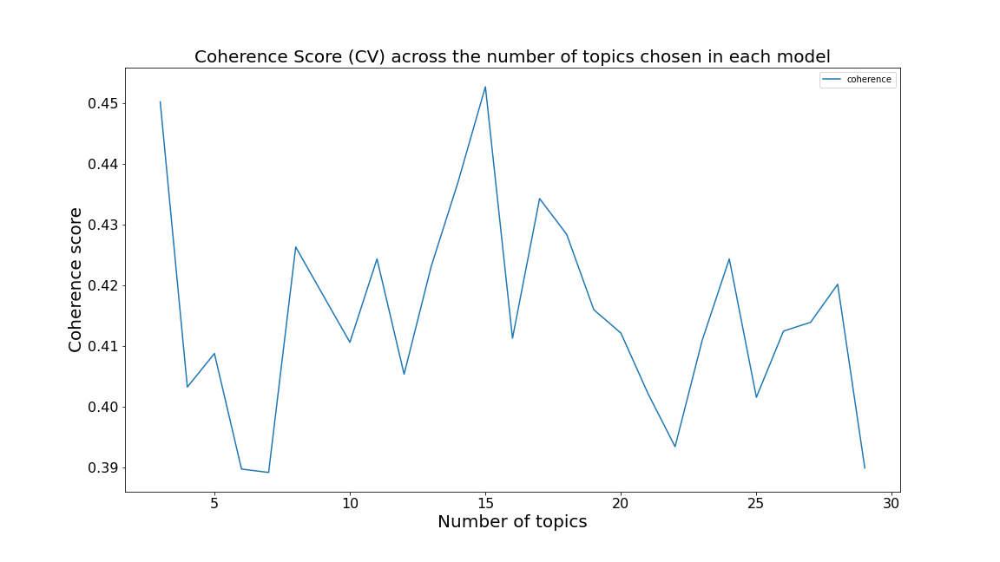
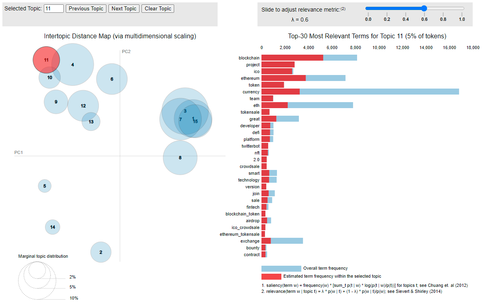

<!--- For HTML Only --->
`r if (!knitr:::is_latex_output()) '
$\\def \\mb{\\mathbb}$
$\\def \\E{\\mb{E}}$ 
$\\def \\P{\\mb{P}}$
$\\DeclareMathOperator{\\var}{Var}$ 
$\\DeclareMathOperator{\\cov}{Cov}$
'`


```{r setup, include=FALSE}
knitr::opts_chunk$set(echo = FALSE)
```

```{r read libraries, include=FALSE}
#READ IN LIBRARIES NEEDED
library(tidyverse)
library(knitr)
library(tibbletime)
library(dplyr)
library(ggplot2)
library(lmtest)
library(knitr)
library(kableExtra)
library(stringr)
```

\tableofcontents
\pagebreak


*Note: No individual tweets will be shown in this document as to comply with the ethics policy of this report.*

# Abstract

Sentiment analysis is a field which discerns the different moods of pieces of texts (known as documents), such as an article or a tweet and classifies these documents into their moods.  In the past, very often lexicon based methods for sentiment analysis have been used,  seen in the amount of papers pre-2015 that were published for lexicon based sentiment analysis methods, through which a dictionary is used to give  each word in a document a polarity score, from -1 to 1, depending on how negative or positive the word is and as a result each document is given a polarity score.  This is useful in distinguishing the postivity of a group of documents, however it is not capable of producing something more nuanced than a positive and negative mood.  Topic modeling is a method in which textual data, that is a large corpus (group) of documents can be split into various groups, or topics, depending on the language used within in each document. The LDA algorithm is a type of topic model which classifies groups using a generative process and aims to find a hidden structure in the data, a structure which represents the topics of each document in a corpus, and as a result groups up documents into interpretable topics where documents each topic have that particular topic in common. This method for sentiment analysis has been gaining traction recently since it can find moods nuanced than the polarity score, for example a topic could be "angry" or "puzzled" in regards to tweets that react to a piece of news which lexicon based methods are not able to. This report aims to undertake sentiment analysis using topic modeling, specifically the Latent Dirichlet Allocation algorithm,  on tweets that mention a type of cryptocurrency called  bitcoin or its acronym, BTC, to  classify and understand the topics spoken about within these tweets. The report explores different methods in regards to text analysis and topic modeling, the explores in depth theory behind LDA topic modeling, how and why data is pre-processed and how outputted topics can be labeled. The pre-processing steps and parameter tunings are explored  using past publish papers as a guide in order to create the most effective topic model. The resulting model produced 15 topics of which a label was assigned that represents the themes spoken about in terms of bitcoin. These topics were discerned by inspecting the word distributions of each topic, and the individual tweets within each topic. The 15 topics were found to be distinctive in their subject matter, however there were some overlaps and subtopics within some of the topics.  The results highlighted the topic model's ability to identify topics made up of auto-generated tweets by bots, which could be useful for eliminating these tweets so only human made tweets are present in the data,  and generate more nuanced sentiments other than the positive and negative ones resulting from lexicon based sentiment analysis. In order to label each outputted topic, it was important to observe both the word distribution and individual tweets within the corresponding topic and using one of these tools would not be sufficient to label the topic. Labeling of topics was found to be a subjective process and prone to mislabeling and in this regard improvements can be made, perhaps developing statistical methods to guide the labeling of topics. Time series analysis was undertaken exploring the proportion of positive sentiment tweets from the corpus with tweets and how this relates with the price of bitcoin over time but found nothing significant, however there is scope to delve deeper into this statistical method to see if there exists a relationship between the proportion of certain sentiments and the price of bitcoin.

This report is structured in the following way. Section one gives a background into the reasons text-based analysis have developed, it's needs and it's uses. Section two explains what this project aims to achieve using LDA,  a topic modeling algorithm. Section three explains the branch of text-analysis known as "topic modeling". It gives different statistical techniques in this branch and explores their advantages and disadvantages. Section four explores the theory of the LDA algorithm, which sits at the core of this project.
Section five outlines how the data is taken in its raw form and converted into a form that can be analysed with the final step running the LDA Algorithm and investigates what are the best strategies in order to get the best possible result from the model. Section six explains the visualisations, and the theory behind them, which represent the resulting topic model run against the bitcoin data. In section seven the results are presented with the following section eight and nine a discussion of the results and the report's conclusion respectively. 

# 1 Text Analysis and NLP: A Background

## 1.1 Background 

Data is becoming increasingly more important to both businesses and individuals.  Businesses are generating vast quantities of data; consequently there is a desire to investigate a utility of this data. For example, a business might sell their goods on Amazon and receive thousands of customer reviews a day. Data is traditionally thought of as being spreadsheets with cells being populated by numbers, however, the textual-review data, as used as an example above, also has it's uses. In the case of reviews, it represents a sign of the quality of that product, this "sign" is in essence a piece of data. In the same way, social media represents a vessel of data that represents the thoughts and feelings of it's users; that is, there are reams of textual data that indicate a feeling and opinion about a given topic. From casually browsing Twitter for example,  a few tweets can be read regarding the latest news event and after reading five to ten tweets it could be conclude how the users of Twitter are feeling about this event.


Twitter, a microblogging site, is one of the most popular social media platforms and plays a huge role in influencing and expressing public opinion. About 500 million tweets are published everyday - where each tweet is a message limited to 288 characters [@twit2]. It's an important tool to understand the public's opinion and emotion -  having three hundred and thirty million users each month [@twituse]. 


That act of browsing and reading of tweets is effectively a data gathering exercise to discern the opinion of the people. Since language is the way humans interface and naturally share data, it's completely natural to humans to read these words on a screen, coming from multiple tweets, and form a single opinion about how people must be feeling about that topic.  For example, looking at tweets that speak about tax increases, ten tweets may be read, seven of which may criticise this change in policy, two of which may praise it, and one that is in between those two feelings. From this a reader of these tweets can conclude that the attitude to increasing taxes is largely negative, with seven of the ten tweets carrying negative connotations. 

In addition to tweets being useful in gauging opinion of it's users, as time goes on more people are using Twitter - meaning there can be varied opinions on a particular topic. Along with the advent of smartphones across the globe and the ease of access of internet, the volume of users voluntarily inputting text data has exploded; adding to the importance of being able to analyse this data in a statistically structured way. 


In terms of how this data is analysed, the problem with text data is that it is unstructured -  unlike numbers that represent financials or demographics with set numerical rules; and therefore it is inherently difficult to work with. Text is often hard to interpret to a machine, with it's grammar, syntax rules and complex patterns and as a result it is not straight forward to carry out statistical techniques on text data.

There are however rigorous statistical techniques that have been developed that allows text data to be processed statistically. Under the umbrella known as "NLP" - Natural Language Processing, these techniques aim to understand text-based data. NLP, where a Natural Language is any language that evolved with humans to communicate, uses the linguistic rules that every language has in order to extract information from pieces of text. It enables computers to process and understand human language. Using these techniques it's possible to gauge the opinion of Twitter's userbase using Sentiment Analysis [@twitsent1]. 

## 1.2 Sentiment Analysis

Sentiment analysis is a way to evaluate emotional states and subjective information from text data. It tries to discern the opinion of the author of piece of text, where a piece of text may be a produce review or a tweet, as discussed previously, and in turn is able to draw conclusions of the sentiment of groups of texts. For example, sentiment analysis can be used to online movie reviews to give a rating to a movie [@sa1].  It can also be used to classify product reviews depending on their sentiment [@sa2]. These methods classify texts into positive, negative and neutral sentiments in various different ways [@sa3]. Different machine learning methods are used in order to classify texts into sentiments using classifiers such as Naive Bayes (NB) [@nb1] , Maximum Entropy [@me1] and Support Vector Machines (SVM) [@svm1]. There are four basic sentiment analysis  approaches [@sa3]:

* Supervised Machine-Learning based
* Ensemble Methods
* Lexicon-based
* Hybrid


Supervised Machine-Learning methods take in labeled data;  texts that have been labeled positive, negative and neutral.  The classifier is trained on this data and a test dataset is used to gauge its performance. @slm1 developed a model that obtained sentiment from Twitter data, comparing SVM and NB classifiers, with SVM performing better.  Ensemble methods combine multiple classifiers in order to get more accurate results [@ens1]. Using a dictionary of words that have attached a sentiment rating to each word,  Lexicon-based methods attempts to match up words in pieces of texts to the lexicon to obtain the sentiment of the text [@lex1].  This is an unsupervised approach that doesn't require labeled data. @unsuper1 stated that it is an easy task to collect huge amounts of unlabeled data from social networks, however for model  training purposes, manually labeling these data is very costly. For that reason unsupervised sentiment analysis methods are extremely important - especially since the volume of unlabeled data continues to increase. The Hybrid system uses a combination uses various lexicons and classifiers; @hybrid1 combined machine learning, ruled based and lexicon based methods to obtain results, achieving good outcome measures.

Another way to perform sentiment analysis is by using topic modeling. This aims to classify unlabeled data into topics. For example, when analysing a random sample of one hundred tweets, ten percent of those tweets may belong to the topic of politics, fifty percent may belong to sport, and forty percent may belong to music. This assignment-to-topic process is done via statistical methods, sitting at the core of this report and are explored further into this report. Topic modeling has been successfully used in analysing online reviews for airlines [@topmod2] and found to improve performance of sentiment classification [@topmod3] . The benefit of using topic modeling to describe the sentiment of texts is that it has the ability to classify texts into finer detail than the polarity analysis described previously, where texts are classified as positive, neutral or negative - topic modeling can split a corpus of text into any number of topics. It also has the potential to be more accurate in sentiment assignments across different domains. For example, the word "unpredictable" in the phrase "unpredictable steering" would be perceived as the lexicon algorithm described previously as negative, but in the domain of movies, the same word in the phrase "unpredictable plot twists" would denote something positive [@topmod1].  Positivity and negativity is contextual - a tweet that says "Bitcoin is going to the moon, buy bitcoin" may be classed as neutral with lexicon methods, since "going to the moon" is a phrase that a lexicon can't detect and calls to buy bitcoin is neither positive nor negative, however this is clearly a positive tweet in the domain of Bitcoin, since "going to the moon" means that the author believes the price of bitcoin is going to rise.  This results in topic modeling, being an unsupervised method that doesn't require labeled data, nor needing a dictionary that defines words, being highly portable to other domains [@topmod1; @topmod2] because it gleans meaning from intra-document similarity. topic modeling has been found to be a successful method in undertaking sentiment analysis of Twitter data [@toptweet1; @toptweet2; @toptweet3]. There are also many other machine-learning methods that analyse the sentiment of tweets [@twitsent1] with a high degree of success.  


## 1.3 Supervised and Unsupervised Machine Learning with NLP

Supervised machine learning is taking labeled data and using it to express the relationship between the labels and the independent variables in the data. To illustrate using an example, this would mean taking Twitter data that express an opinion about Covid-19 and manually labeling them "misinformation" if it contains misinformation and "information" is it contains real information. The relationship could then be explored between the text and the labels and this relationship can be used to predict if a new, unlabeled and unread tweet as having misinformation to a certain percent of accuracy.

However, since there is exponentially more text information available, it is extremely inconvenient for these texts to go through a process of labeling since it requires a human to read each text. Therefore it is common to apply unsupervised (unlabeled) statistical techniques to this type of text data. There are a  family of machine learning algorithms that try to discover latent hidden structures and patterns in unlabeled text data from their various attributes and features. Several unsupervised learning algorithms are also used to reduce the feature space, which is often reduced data from a higher dimension to one with a lower dimension. This dimensionality reduction can be seen as taking a large number of documents and assigning them into a relatively small amount of groups, where each group has its own topic which describes broadly the type of tweets the group contains. The statistical techniques that carry out this process are known as "topic models". 


## 1.4 How computers use text data

A "Document" is a single separate piece of text, in the context of tweets, a document would be one tweet. If news articles were to be analysed, a document would be one article. Documents comprise a "Corpus", which is all the documents combined into one dataset

Machine learning techniques traditionally need numerical data in order to perform an analysis. A logistic regression is a simple machine learning tool that can express the segmentation of a dependent variable with two groups as a function of its independent variables. It's possible to have exactly the same framework using text data.

To give a toy example, suppose there are ten documents with each document being a single tweet, five of which give misinformation about Covid-19, and five of which give true information about Covid-19.  The aim is to build a logistic regression such that the relationship between the text in each tweet and its label of misinformation/information is obtained. However, a logistic regression cannot do this because it can only interpret numerical data. The logical step then is to convert these documents (tweets, in the example) into numbers. This is done via "Vectorisation" of each document. The corpus of documents are represented as a matrix where each row is document with its vector representing the words in the document. The columns are all the words in the corpus. The numbers in the matrix represent the amount of times a word (the columns) appears in a document (which is a row). Each row then represents all the text in one of the documents. This process converts text data into numerical data and as a result machine learning techniques can be used on this matrix. Creating this matrix requires processing steps so that it is primed for statistical analysis to be carried out. The process of splitting each document into it's individual words is called "Tokenisation". This is a list of words that appear in each document which is part of the "vectorisation" process. For each document, this list of words is vectorised using one of the following techniques:

1. Document-Term Matrix - a matrix where each word is a column, each row is a document (one piece of text data) and the number in each cell is the number of times the column's word appears in the document's (row) text. An example of this matrix is given in Figure \ref{fig:bowmat}.

```{r bowmat, echo=FALSE, fig.cap = "A toy example of a document-term matrix which is part of the pre-processing step in order to perform NLP.", out.width='100%', fig.asp=0.4}
knitr::include_graphics("images/16034397439042_surfin bird bow.png")
```


2. Term Frequency — Inverse Document Frequency (TF-IDF). This generates a matrix that assigns a weight to each word which signifies the importance of the word in the document and corpus. This is more sophisticated than the term-document matrix approach. The importance of a word in each document is based on the amount of times it appears in the document and also how rare the word is in the corpus. Rarer words in a document are given a higher weighting as rare words help distinguish what topic the document belongs to. For example, if a document contains a rare word "nuclear", this is likely to be a good indicator that the document is about the topic "energy". If a word appears frequently in a document but infrequently across the whole corpus, it is given a large weight. 

3. word2vec -  uses a pre-trained neural network model to learn word associations from a large corpus of text. Once trained, such a model can detect synonymous words or suggest additional words for a partial sentence. This is even more sophisticated than the above as context of the word is taken into account.

Using one of these methods to convert a corpus of documents into a matrix, machine learning techniques can be used in order to classify documents and other operations.


## 1.5 Applications of NLP

* **Machine Translation** - translating text from one language to another. This is becoming more accurate with the aid of Deep Learning [@mt1].
* **Automatic Speech Recognition (ASR)** -  Recognition of vocal language and converting it to text, aiding human-human and human-computer interactions. As Machine Learning techniques have access to more powerful computers, the amount of errors in ASR are reduced [@asr1].
* **Question Answering Systems** - Aims to provide quick answers to user questions from a collection of documents in a database [@qas1] For example chatbots often used to interface between clients and businesses. Another example is Personal Assistants such as Siri. This has been successfully used in the domain of medical questions [@qas1]. 

* **Text Summarisation** - Taking a large piece of text and condensing it but retaining the original meaning. This has been successfully used to summarise large pieces of legal texts into smaller summaries for lawyers and citizens to do research relates to their case [@sum1]. 

* **Text Categorisation** - Classifying texts. For example, perhaps given a piece of text, a tweet in this example, analysing the words gives rise to ability to classify it as a tweet that contains misinformation about Covid-19 to a certain level of accuracy using machine learning techniques. This has been successfully performed using Recurrent Neural Networks as the classifying algorithm [@textclass1].

* **Text Analytics** - Deriving insights from text data. Methods include clustering, summarisation, sentiment analysis. An example application of this is Spam detection. Statistical techniques are used to classify certain emails as spam so they don't reach a user's inbox.


* **Topic Modeling** - Classifying a corpus of documents into topics. This finds hidden structures in large amounts of data and has been applied to information retrieval, social media analysis and text mining [@topmoda1]. Within these methods, topic modeling has also been applied to a large amount of domains, from medical sciences, software engineering, geography and political science [@topmoda1] demonstrating its versatility.


<!-- //from] -->
<!-- wiki 2000s: With the growth of the web, increasing amounts of raw (unannotated) language data has become available since the mid-1990s. Research has thus increasingly focused on unsupervised and semi-supervised learning algorithms. Such algorithms can learn from data that has not been hand-annotated with the desired answers or using a combination of annotated and non-annotated data. Generally, this task is much more difficult than supervised learning, and typically produces less accurate results for a given amount of input data. However, there is an enormous amount of non-annotated data available (including, among other things, the entire content of the World Wide Web), which can often make up for the inferior results if the algorithm used has a low enough time complexity to be practical. -->


<!-- from dataversity -->
<!-- Natural Language Processing (NLP) is an aspect of Artificial Intelligence that helps computers understand, interpret, and utilize human languages. NLP allows computers to communicate with people, using a human language. Natural Language Processing also provides computers with the ability to read text, hear speech, and interpret it. NLP draws from several disciplines, including computational linguistics and computer science, as it attempts to close the gap between human and computer communications. -->

<!-- Generally speaking, NLP breaks down language into shorter, more basic pieces, called tokens (words, periods, etc.), and attempts to understand the relationships of the tokens. This process often uses higher-level NLP features, such as: -->

<!-- Content Categorization: A linguistic document summary that includes content alerts, duplication detection, search, and indexing. -->
<!-- Topic Discovery and Modeling: Captures the themes and meanings of text collections, and applies advanced analytics to the text. -->
<!-- Contextual Extraction: Automatically pulls structured data from text-based sources. -->
<!-- Sentiment Analysis: Identifies the general mood, or subjective opinions, stored in large amounts of text. Useful for opinion mining. -->
<!-- Text-to-Speech and Speech-to-Text Conversion: Transforms voice commands into text, and vice versa. -->
<!-- Document Summarization: Automatically creates a synopsis, condensing large amounts of text. -->
<!-- Machine Translation: Automatically translates the text or speech of one language into another. -->


\newpage


# 2 Aims


## 2.1 Motivation for and summary of the project

In early 2021, the impact of social media on the stock market gained notoriety when the price of GameStop (GME) stock went from hovering around \$20 to reaching the lofty heights of $347 dollars in just one month. This increase was attributed to the collective frenzy that took place on the social media platform of Reddit, specifically the sub-forum known as "wallstreetbets" that encouraged users to buy more stock which in turn elevated the stock to those high prices.

This was a clear demonstration of how public word-of-mouth can impact the stock market, but this kind of thing has happened for time immemorial. Before social media, word-of-mouth opinions about stocks would have also made an impact on the price of stocks. The difference now is that these opinions are much more visible, and importantly for this project, they are recorded. 

This project aims to use topic modeling on tweets that refer to  the cryptocurrency Bitcoin in order to see what topics people are talking about on twitter, and for further analysis, to see if the frequency of these topics impact the price of bitcoin. Using topic modeling, tweets are classified into groups depending on the topic discussed in each tweet. This reveals the topics and sentiments of the public in regards to bitcoin and also how these sentiments change through time will be analysed. It aims to fuel further investigation beyond this report on how these topics of public opinion influences the price of bitcoin. 

There have been published papers that have investigated whether public mood with respect to a particular company or asset, garnered from Twitter, was correlated with the stock market and found that this was indeed the case [@stock3; @stock4] and some papers have found this link using the sentiment analysis described above [@stock5; @stock6]. Traditionally, predicting the stock market was done by using random walk theory and Efficient Market Hypothesis (EMH) which claims that prices are driven by new information - i.e news [@stock1]. News in unpredictable and follows a random walk and cannot be predicted with more than fifty percent accuracy [@stock2]. This notion has been contradicted by a body of research and there are papers that suggest that the stock market doesn't follow a random walk and can partly be predicted [@stock2].  

This report aims to explore different types of topic models and discuss their strengths and weaknesses, based on the theory they come from. A discussion will be made about how data should be processed before a model is undertaken, using past papers as a guide for this process. Finally, the sentiment of tweets will be found by performing and LDA topic model and the relationship of these sentiments with bitcoin price wil briefly be explored.

## 2.2 An overview of the approach to be taken


Reading social media posts gives the reader an understanding of the opinion and feeling of the public for a particular topic. For example,  a social media poster may simply say "I believe Bitcoin is going to be worth £1.2 million one day" and although the poster's believed price may not be remembered by the reader, the sentiment of the post - that bitcoin is going to increase in value - will be.

In this example for simplicity and demonstrative purposes,  consider trying to assign tweets to just two topics - "positive" or "negative"; the above example tweet can be classified as a "positive" sentiment for Bitcoin. A post using skeptical language in regards to bitcoin can be classified as "negative". 

Probabilistic topic modeling, a type of machine learning algorithm outlined by @blei, can be used to analyse posts/articles for the type of language they use regarding a certain asset at a time point, and the frequency of positive or negative posts can found for a particular asset. This then gives us a "sentiment score" - telling what is the public opinion of the asset, is it mainly positive, negative, or equal? This type of analysis is known as Natural Language Processing (NLP). 


Topic modeling algorithms analyse the words of the original texts to uncover the underlying topics, where a topic can be interpreted as a sentiment, that run through the tweets and how the importance of these topics change through time depending on when the tweet was posted. This project uses uses Latent Dirichlet Allocation (LDA) to allocate tweets to topics.

Classifying a post/article into positive and negative is a useful way to gauge public opinion, however, positive and negative posts can be classified into further topics. For example, how positive is the post, perhaps the language of the post is hugely positive, so it can be classified as "very positive". Perhaps the language used is positive, but tinged with some negativity of skepticism - and this could be classified as "weakly positive". Further still, within the trading community there are trading behaviours known as "bearish" (many people following the trend of selling) and "bullish" (many people following the trend of buying) and the posts can be further classified into these groups. 

Using the sentiments obtained from the data, a time series analysis will be performed, exploring the relationship between bitcoin price and sentiments expressed on twitter about bitcoin. 


## 2.3 The Data


Tweets were pulled using the Twitter API, comprising 166,050 tweets. Sixty tweets were randomly sampled for each day that contain the terms "BTC" or "Bitcoin" for Bitcoin data. This data was pulled for tweets posted from January 1st 2016 until August 31st 2021. The data is extracted as a CSV (comma-separated values) file.

This data will then be run through an LDA topic modeling pipeline to find the underlying topics in these tweets. 


\newpage
 
# 3 Topic Models

## 3.1 Introduction


To serve as an introduction to topic models a toy example is considered: Suppose there is data comprising twenty thousand tweets expressing opinions about Covid-19. Using unsupervised machine learning techniques and the vectorisation of text explained above, the data can be mathematically expressed and analysed. These tweets can be grouped into three groups using machine learning algorithms with the following aim: tweets in group one contains text that refer to Covid-19 cures, group two contains tweets about Covid-19 vaccines and group three contain tweets about Covid-19 prevention. These groups can be interpreted to be topics. To reach this goal, a range of statistical techniques are used called topic models.

Topic models extract the distinguishing concepts, or topics, from the the corpus (that is, all the documents). It groups up documents into topics without human intervention and judgment. These topics can include opinions or facts. The models then use statistical techniques to explore the hidden and latent structures in the corpus in order to group up documents, where the hidden structures in the corpus refer to topics.


## 3.2  Methods for Topic Modeling

There are various algorithms to carry out topic modeling.

The following three methods are explored in the following chapters:

* Latent Semantic Indexing (Section 3.3).
* Non-negative matrix factorization (Section 3.4).
* Latent Dirichlet Allocation (Chapter 4).

## 3.3 Latent Semantic Indexing (LSA)

Latent Semantic Analysis takes the matrix that contains the documents and terms and decomposes it into a document-topic matrix and topic-term matrix - this is the TF-IDF matrix explained in Section 1.1. Since the matrix contains all the terms in the corpus and a lot of terms will not be important in defining the topics, this matrix will be sparse. In order to find only a few topics this matrix needs to undergo dimensionality reduction. This reduction can be done using truncated Singular Value Decomposition (SVD); a technique that factorises a matrix into the product of 3 separate matrices, as seen in Figure \ref{fig:lsa_svd} [@albrecht] and given by the equation:

\begin{equation}
V \approx U \cdot \Sigma \cdot V^*,
\end{equation}

where $V$ represents the TF-IDF matrix, the matrix  $\Sigma$ represents the singular values of $V$ and to keep the most important topics only the top $t$ largest singular values are kept, which means keeping only the first  $t$ columns of $U$ and $V^*$. In other words, $t$ is a hyperparameter which adjusts the number of topics outputted by the SVD.

$U$ represents the document-topic matrix, $V^*$ represents the term-topic matrix. For both matrices the columns represent topics. For $U$, the rows represent the document vectors expressed in terms of topics. The rows in $V$ represents the term vectors expressed in terms of topics. The numbers in the cells represent how important the topic is for the term or document in $V^*$ and $U$ respectively. In this way, the documents can be assigned a topic by choosing the highest topic importance value [@albrecht].


```{r lsa_svd, echo=FALSE, fig.cap = "Singular Value Decomposition of the document-term matrix used in Latent Semantic Indexing to perform topic modeling.", out.width='100%', fig.asp=0.4, fig.align="center"}

```


## 3.4 Non-negative matrix factorisation

One way to find the hidden topics of a corpus is the factorisation of the "document-term matrix" - this is the a matrix with the rows being the documents and the columns being the words in the whole corpus - and if a document contains a particular word in the corpus it gets a value of the amount of times the word appears in the document in that cell where the column is that particular word [@albrecht]. This matrix has only positive-value elements, consequently methods from linear algebra can be used to order to represent the matrix as the product of two other non-negative matrices. The original matrix is called $V$, and the factors are $W$ and $H$:

\begin{equation}
V \approx W \cdot H,
\end{equation}


and can the factorisation is visualised in Figure \ref{fig:nmf} [adapted from @albrecht].

```{r nmf, echo=FALSE, fig.cap = "Non-negative matrix factorisation of the document-term matrix, a technique used to perform topic modeling.", out.width='100%', fig.asp=0.4, fig.align="center"}

```
In the context of text analysis, both $W$ and $H$ have an interpretation. The matrix $W$ has the same number of rows as the document-term matrix and therefore maps documents to topics (document-topic matrix). $H$ has the same number of columns as features, so it shows how the topics are constituted of features (topic-feature matrix). The number of topics (the columns of $W$ and the rows of $H$) can be chosen arbitrarily. The smaller this number, the less exact the factorization.


The above two methods are computationally much cheaper than LDA but lacks  the ability to find multiple topics in single documents - this ability is gained by adding a Dirichlet prior on top of the data generating process which is used in the Latent Dirichlet Allocation algorithm.


\newpage


# 4 Latent Dirichlet Allocation (LDA)


## 4.1 LDA Introduction


LDA considers each document as consisting of a mixture of different topics and these topics are made up of a mixture of words. To ensure that the number of topics per document is low and to have only a few important words constituting the topics, LDA uses a Dirichlet prior in its statistical process. This is applied both for assigning topics to documents and for assigning words to the topics. After these initial assignments, a generative process begins. It uses the Dirichlet distributions for topics and words and tries to re-create the words from the original documents with stochastic sampling. This process has to be iterated many times and is therefore is computationally intensive. The results can be used to generate documents for any identified topic. For a given corpus of documents, each document can be represented as a statistical distribution of a fixed set of topics. LDA assumes that each document is generated by a statistical generative process governed by a document's topic distribution, and the topics' word distributions. After this generative process has taken place and when the documents generated that most closely resemble the actual documents in the corpus, the topic distribution of the documents can be observed to assign documents to topics.

## 4.2 LDA In-Depth

Topic models are based on the idea that each document, that is each piece of text, are a mixture of topics. For example, perhaps there is a news article about electric vehicles and how it impact the economy. In this example it can be said this document (i.e the article) is a combination different topics, not just one - it could well be 50% "transport", 30% "technology" and 20% "economy". This distribution is labeled as $\theta$ and is shown in figure \ref{fig:plot1} for the explained example.


```{r plot1, echo=FALSE, fig.cap="Example of a multinomial distribution of the Topics in LDA for a single document.", out.width = '80%', fig.align="center"}
dfplot <- data.frame(Topics=c("Transport", "Technology", "Economy"),
                len=c(50, 30, 20))


p<-ggplot(dfplot, aes(x=Topics, y=len, fill=Topics)) +
  geom_bar(stat="identity")+theme_minimal() +
  ylab("Percent")
  #+ ggtitle("hello")
p
```

Documents have a probability distribution over topics, as described in the example. A document chosen at random may have any percent of $n$ different topics. Equally, it can be said a topic is a distribution over words. Any topic can be defined by a list of words that appear in that topic with varying frequencies. For example consider that the topic "transport", for simplicity, comprises three words - "car", "bus" and "roads" - "car" appears 70% of the time for that topic, "bus" 10% and "roads" 20%. Figure \ref{fig:plot2} shows a toy example of a word distribution for the topic "transport" in from Figure \ref{fig:plot1}. The other two topics in Figure \ref{fig:plot1} would have their own word distributions.

```{r plot2, echo=FALSE, fig.cap="Example of a multinomial distribution of the words in a Topic in LDA.", out.width = '80%', fig.align="center"}
dfplot <- data.frame(Topics=c("Car", "Bus", "Roads"),
                len=c(70, 10, 20))


p<-ggplot(dfplot, aes(x=Topics, y=len, fill=Topics)) +
  geom_bar(stat="identity")+theme_minimal() +
  ylab("Percent")
  #+ ggtitle("hello")
p
```


This is analogous to the reality where, if you were to read an article you might discern it's topic by considering the words used in the article and also the frequency of the words used in the article to make the judgment. For example the word "car" would appear more often than the phrase "petrol station" across all topic "transport" documents - leading to the conclusion that the main topic would be indeed "transport" and not "energy" which might be the case if the phrase "petrol station" were to be more prevalent. 


A topic model is a generative process that describes a statistical procedure through which the observed documents can be produced with the highest likelihood.  A generative process for documents describes how words in documents might be generated based on variables that are not seen - latent variables. It aims to find the best set of latent variables that explains the production of the documents in the corpus. These latent variables dictate the probability distributions described above in the toy examples. The aim of LDA is to define these latent variables such that the generated documents resemble the observed    documents as closely as possible.

## 4.2.1  The Generative Process of LDA

A document in the corpus can be assumed to be created by first choosing a distribution over topics  - just like how an author might decide they are going to write about two topics with proportions 60% "transport" and 40% "technology". These two topics are then the distribution of topics per document.  After, for each place where a word appears in the document, a word is chosen from a distribution of words from the selected topic; where the selected topic is sampled from the distribution of topics per document. For example, the topic "transport" is sampled for the first word, and within topic "transport" there is a distribution of words taking the form of 60% "car" and 40% "bus". A word is chosen from this distribution and since "car" is most likely, for this first word of the document "car" is chosen. The role of LDA is inferring these topic and word distributions through which the documents most likely have been generated.

In practice when using LDA, each document is a distribution over many topics, but typically each document is dominated by one or two topics - just as in real life where an article typically only has one or two topics. Each of those topics have also a distribution of many words. For example a topic may have thousands of words within its word distribution. Roughly speaking, the Dirichlet distribution is used to constrain the amount of topics that define a document, and also the amount of words that define a topic. This yields results which are easier to interpret. 

The generative process which gives topic and word distributions is useful -  by seeing the distribution of words in a topic the topic can be given a name. For example if the words "fight" and "glove" were grouped together in a distribution with 80% and 20% probability respectively, it can easily say that this topic is about boxing.

### 4.2.1 Notation

The distribution over words within the document specified by the model given by:
\begin{equation}
P(w_i) = \sum_{j=1}^{T}P(w_i|z_j =j)P(z_i=j),
\end{equation}
where $P(z_i=j)$ is the probability that the *j*th topic was chosen for the *i*th word,  $P(w_i|z_j =j)$ is the probability of the word $w_i$ under topic *j*
and $T$, the number of topics.


## 4.3 The Dirichlet Distribution


The Dirichlet distribution $Dir(\alpha)$ is a family of continuous multivariate probability distributions parameterised by a vector $\alpha$ of positive reals. It is a multivariate generalisation of the beta distribution. The Dirichlet distribution is a conjugate prior to many important probability distributions and specifically a conjugate prior to the multinomial distribution - the distribution LDA uses for sampling topics and words. The Dirichlet distribution is used in LDA to sample a multinomial distribution of topics and words. It is useful because it allows for topics and words to have varying probabilities of being sampled, allowing for documents to be confined to one to two topics which is a more natural way to interpret a document.


Multinomial distributions can be drawn from a Dirichlet distribution which is needed to sample $\phi$ and $\theta$, where ${\phi}^{(j)} = P(z=j)$ is a multinomial distribution over words for topic *j* and ${\theta}^{(d)} = P(z)$ is a multinomial distribution over topics for document *d*. These are the latent variables which LDA ultimately aims to approximate. The parameter $\theta$ indicates what topics are important for a particular document and $\phi$ indicates what words are important in each topic. 


### 4.3.1 Toy Example for the Dirichlet Distribution


In this example inspired by @diriex, suppose a six-sided dice is to be manufactured with the outcomes of the dice being only the numbers one, two and three. If this is a fair die then the three outcomes with have the same probability of $\frac{1}{3}$. The probabilities of the outcomes can be represented by the vector $\boldsymbol{\mathbf{\theta}} = (\theta_{1}, \theta_{2}, \theta_{3})$. Since the sum of these probabilities must be equal to one and none of the probabilities can be negative, rolling the dice can be described by a multinomial distribution. Since each $\theta_{i} \in [0,1]$ this means the set of allowable values for $\boldsymbol{\mathbf{\theta}}$ is confined to a triangle. The Dirichlet distribution is used to define the probability density at each point on this triangle. 


The Dirichlet distribution defines a probability density for the vector $\boldsymbol{\mathbf{\theta}}$  and is given by 
\begin{equation}
Dir(\boldsymbol{\mathbf{\theta}}| \boldsymbol{\alpha})= \frac{1}{beta(\boldsymbol{\alpha})}\prod_{i=1}^{K}\theta_i^{\alpha_i -1}
\end{equation}

where $K$ is the number of variables in the vector $\boldsymbol{\mathbf{\theta}}$. 

The Dirichlet distribution is parameterised by the vector $\boldsymbol{\alpha}$ which has the same number of elements as $\boldsymbol{\mathbf{\theta}}$, that is $K$. $P(\boldsymbol{\mathbf{\theta}}|\boldsymbol{\alpha})$ can be interpreted as giving the probability density associated with the multinomial distribution $\boldsymbol{\mathbf{\theta}}$ given the Dirichlet parameter of $\boldsymbol{\alpha}$.

The Dirichlet distribution is a multivariate generalisation of the beta distribution. The beta distribution is defined in the interval [0,1] and has two parameters, $\alpha$ and $\beta$. This distribution is a conjugate prior for the binomial distribution, hence the multivariate form of the beta - that is the Dirichlet distribution is a prior for the multivariate form of the binomial distribution, the multinomial distribution. Figure \ref{fig:betadist} (see also Figure 2 in [@diriex]) shows how the distribution profile is changed depending on the values of $\alpha$ and $\beta$. When these parameters are less than one, it can be seen that the edges of the distribution are regions with high probability density. In the context of topic modeling, this can be useful because the samples from this distribution will be generally from one topic since the extremes of the distribution can be linked to a topic. 


```{r betadist, echo=FALSE, fig.cap="The beta distribution with different parameters, which is the univariate version of the Dirichlet distriubtion used in the LDA topic modeling algorithm.", out.width = '100%', fig.align="center"}

```


The Dirichlet distribution can also be visualised where $K=3$; in other words this serves as a toy example where the number of possible topics for the corpus is 3. This means visualising the distribution on a triangle simplex for differing values of $\alpha$ as to investigate how changing $\alpha$ changes the probability distribution. 


```{r dirivis2, echo=FALSE, fig.cap="How the probabiliy distribution for the Dirichlet changes with varying values of alpha - one of the hyperparameters of the LDA algorithm. This hyperparamer influences the distribution of the  multinomial distrubtion of topics for the documents, and the multinomial distribution of the words in each topic.", out.width = '100%', fig.align="center"}

```

Figure \ref{fig:dirivis2} shows that when $\alpha_i < 1$, or  that is to say where $\boldsymbol{\alpha} < K$, higher probability density areas are in the corners of the triangle [@diriex]. The corners of the triangle can be thought of as a topic, since when sampling from the Dirichlet a topic distribution is being sampled. As stated above, this is useful because a document is typically made up of one or two topics in the real world, not a mixture of all possible topics, as would be the assumption if the Dirichlet distribution with all $\alpha_i = 1$ would be used, as seen in the second triangle in Figure \ref{fig:dirivis2}. With the SVD Matrix Factorisation approach described previously in section 3.3, each document has a value for each topic, so a document is assumed to be made up of all the topics in the analysis at varying proportions. LDA has the ability to assume a document is dominated by a small number of topics using the Dirichlet distribution, which is a natural assumption as often pieces of texts only deal with one or two topics, for example, "technology" and "science".


<!-- The Figure \ref{fig:diripic} below it can be seen that changing the parameter $\alpha$, a parameter of the Dirichlet distribution, varies the probabilities in the multinomial distributions . In the equation in \ref{fig:eq1}below, $m_k$ represents the mean and is analogous to centre of the Dirichlet distribution. When $\alpha * m = 1$ the right hand side of the equation becomes 1 (as the exponent is 0) (every multinomial vector is raised to 0) so all of the vectors $p_k$ are equiprobable and that means all the topics are equally likely to sampled. As $\alpha$ gets larger, the probability distribution concentrates around the mean. -->


 <!-- ```{r diripic, echo=FALSE, fig.cap = "Examples of the Dirichlet distribution with varying parameters", out.width='100%', fig.asp=0.4, fig.align="center"} -->
 <!-- knitr::include_graphics("images/dirichlet2.jpg") -->
 <!-- ``` -->

<!-- Using the Dirichlet prior is useful because it allows the model to estimate that the documents are made up of a few topics with one or two topics being stronger than the others. This is intuitive to how real life documents are made and aids interpetability.  -->

### 4.3.2 Dirichlet in detail

With LDA, there is a  Dirichlet prior on ${\theta}^{(d)} = P(z)$, a multinomial distribution over topics for document *d*. This is a conjugate prior for the multinomial. The probability density of a $T$, the number of topics, dimensional Dirichlet distribution over the multinomial distribution $p=(p_1,...,p_T)$ and is given by:

\begin{equation}
Dir(\alpha_1,...,\alpha_T) =  \frac{\Gamma(\sum_{j}^{}\alpha_j)}{\prod_{j}^{}\Gamma(\alpha_j)}\prod_{j=1}^{T}p_j^{\alpha_j -1}
\end{equation}

The parameters of this distribution are specified by $\alpha_1,..\alpha_T$. Each hyperparameter $\alpha_j$ can be interpreted as a prior observation count for the number of times topic $j$ is sampled in a document before having observed any actual words from that document. The Dirichlet prior on the topic distribution $\theta$ results in a smoothed topic distribution depending on the $\alpha$ parameter. This parameter controls the number of topics for each document or, in other words, it controls the probability distribution of topics for each document. Sampling from the Dirichlet distribution means getting a multinomial distribution for the topics for that document. The $\alpha$ parameter is a hyperparameter, that is a parameter of parameters, that dictates what the multinomial distribution of topics looks like for each document. The benefit of the Dirichlet distribution is that for $\alpha<1$ the multinomial distribution is often represented by a few topics. If $\alpha>1$ the distribution is quite even - that is the distribution is represented by many topics. It is more natural to assume a document only contains a few topics, just like a document in real life. For that reason an $\alpha<1$ is a useful parameter in topic modeling. 

A Dirichlet distribution prior is also placed on $\phi$, the multinomial probability distribution of words of each of the topics, using the parameter $\beta$. It can be interpreted as the prior observation count on the number of times words are sampled from a topic before any word from the corpus is observed. Just like the $\alpha$ parameter, it controls the word distribution for each topic, either making the probability distribution uniform or having only a few words that have high probabilities for each topic. Again, this is important because for some topics not all words are equally as important. For example, in the topic of "finance", the word "money" defines the topic much more than "bank", since "finance" can be described without mentioning banks, and also banks may refer to a river bank. 

In summary, there are two Dirichlet distribution used in LDA, and each distribution comes with its own hyperparameter, defined as:

- $\alpha$ - controls how different the probabilities will be for words in the topics.
- $\beta$ - controls how different the probabilities will be for topics in the document.

## 4.4 Plate notation


Plate notation is a way to represent the LDA algorithm [@steyvers], shown in Figure \ref{fig:boxdia} (adopted from [@steyvers]). Shaded and non-shaded areas indicate observed and latent variables respectively. $\phi$, the distribution of words in the topics, $\theta$, the distribution of topics in each document and $z$, the assignment of word tokens to topics are what three latent variables aim to infer. $\alpha$ and $\beta$ are the hyperparameters that are treated as constants in the model. Arrows represent conditional dependencies between the variables and the plates, the boxes in the figure, refer to repetitions of sampling steps with the variable in the right corner referring to the number of samples. For example, the inner plate that has the bubbles $z$ and $w$ illustrates the repeated sampling of topics and words until $N_d$, the number of words in each document $d$, words have been generated for document $d$. The plate surrounding $\theta^{(d)}$ shows the repeated sampling of a distribution of topics for each document $d$ for a total of $D$ documents. The plate surrounding $\phi^{(z)}$ shows the  repeated sampling of word distributions for each topic $z$ until $T$ documents have been generated. More detail on the plate diagram can be seen in figure \ref{fig:platedialab}.


```{r boxdia, echo=FALSE, fig.cap="Box diagram describing the generative process of LDA, showing the relationships between the latent variables, hyperparameters and distributions.", out.width = '100%', fig.align="center"}

```


```{r platedialab, echo=FALSE, fig.cap="Box diagram with additional notes giving more detail on how the LDA algorithm works.", out.width = '100%', fig.align="center"}
knitr::include_graphics("images/plate dia lab.PNG")
```


The goal of LDA is to estimate $\theta$ and $\phi$ -  latent variables that aren't observed which the model attempts to fit. These latent variables are determined by using the words observed in the corpus, and so the document generating process is reverse engineered to get the parameters that go onto to generate the observed words in the documents. LDA aims to find the parameters that maximise the likelihood of the words observed in the corpus. 

Unlike statistical models such as Ordinary Least Squares Regression, there is no analytic solution with LDA. The best solution can be approximated in an iterative way, using step-wise approach and getting closer to the best solution. One way to do this is with Gibbs Sampling. 

## 4.5 Gibbs sampling

The intuition behind Gibbs sampling is that the topics of all  words are assumed to be known except for the word token of interest, where a word token is a space in the observed document where a word appears. For this word token of interest, a topic must be chosen from the topic distribution for the document. The model prefers to choose a topic that is already present in the document. At the same time, the model also wants to pick a topic that the word already occurs in. So there are 2 probability distributions: one that favors the topics already present in the document and one that favors the topics that this word is already present in.

Taking these two probability distributions together, a joint probability distribution is gained and represents the chance of picking a topic for this one missing word.

The steps involved in Gibbs sampling are as follows:

1. Start with random sampling -  assigning every word in every document to one topic.
2. Then iterate over all the words and all the documents. For each word in each document,  the proportion of topics is computed in that document (disregarding the word itself). 
3. Compute the proportion of topics for that word (disregarding the word itself). I.e what are the topics that the word occurs in and at what frequency?
4. Multiply these two distributions to get a joint probability distribution.
5. Choose a new topic from that probability distribution and then update the proportions.
6. Repeat this step, going to the next word, and eventually to the next document, until every word is updated in every document.
7. Initially there were completely random distributions, but  after these steps there are slightly less random distribution because the this method, for the words, tends to choose topics that are consistent with that document. 
8. Each time these steps are run the solution becomes more stable. These steps are run until it converges to a stable solution.


### 4.5.1 Gibbs Sampling in detail

Gibbs sampling is a form of the Markov Chain Monte Carlo sampling method which samples values from high-dimensional distributions. It simulates a complex distribution by sampling over marginal distributions given a specific value of the other distribution. This is done sequentially until the sampled values approximate the desired distribution.


The Gibbs procedure considers each word token in a document and estimates a probability of assigning the current word token to each topic, conditioned on the topic assignments on the topic assignments to all the other word tokens.  From this conditional distribution, a topic is sampled and then is the new topic assignment for this word token. This conditional distribution can be written as:

\begin{equation}
P(z_i=j \mid z_{-i}, w_i, d_i,\cdot)
\end{equation}

$z_i=j$ represents the topic assignment of token $i$ to topic $j$, $z_{-1}$ refers to the topic assignments of all the other word tokens and $\cdot$ refers to all other known or observed information as such as all the other word and document indices $w_{-i}$ and $d_{-i}$ and hyperparamters $\alpha$ and $\beta$.

This probability is proportional to:
\begin{equation}
P(z_i = j | z_{-i}, w_i, d_i, \cdot) \propto \frac{C^{WT}_{w_ij} + \beta}{\sum_{w=1}^{W}C^{WT}_{wj} + W\beta}\frac{C^{DT}_{d_ij} + \alpha}{\sum_{t=1}^{T}C^{DT}_{d_ij} + T\alpha},
\end{equation}
where $C^{WT}$ and $C^{DT}$ are matrices of counts, $C^{WT}_{wj}$ contains the number of times word $w$ is assigned to $j$, not including the current iteration of $i$, $C^{DT}_{dj}$ contains the number of times topic $j$ is assigned to some word token in document $d$, not including the current iteration $i$.
<!-- (\#eq:test) -->
<!-- \@ref(eq:test) cant get latex referencing working -->

Note that equation 6 isn't the probability of assigning a word token to topic $j$ but it is proportional to the right hand side of the equation. The actual probability is produced by dividing the equation by the sum of all topics $T$. The left part of the right hand side of the equation can be seen as the probability of word $w$ under topic $j$. The right part is the probability that topic $j$ has under the current topic distribution for document $d$. Because the top of the left part $C^{WT}_{wj}$ contains the number of times word $w$ is assigned to $j$, it means that when many tokens of a word have been assigned to topic $j$ across the documents, it will increase the probability of assigning any particular token of that word to topic $j$. At the same time, looking at the right part of the right hand side, if topic $j$ has been used multiple times in one document, this means a higher $C^{DT}_{dj}$, the number of times topic $j$ is assigned to some word token in document $d$, it will increase the probability that any word from that document will be assigned to topic $j$. As a result, words are assigned to topics depending on how likely the word is for the topic and also how dominant that topic is in a document.

Gibbs sampling, in more detail, performs the following steps: 
1. Assign each word token to a random topic.
2. Decrease the count matrices $C^{WT}$ and $C^{DT}$ by one for the entries that correspond to the current topic assignment.
3. A new topic is sampled from the distribution in equation 6 and the count matrices $C^{WT}$ and $C^{DT}$ are incremented with the new topic assignment.
4. Repeat these steps for all $N$ word tokens in the corpus, achieving one Gibbs sample.
5. Repeat steps 1-4 until a stable solution converges - that is the posterior distribution over topic assignments are approximated as best as possible.

### Obtaining the topic and word distributions

Recall that:

- ${\phi}^{(j)} = P(z=j)$, a multinomial distribution over words for topic *j*
- ${\theta}^{(d)} = P(z)$, a multinomial distribution over topics for document *d*

These can be obtained as follows:

\begin{equation}
{\phi}'^{(j)}_i= \frac{C^{WT}_{ij} + \beta}{\sum_{k=1}^{W}C^{WT}_{kj} + W\beta}
\end{equation}
and

\begin{equation}
{\theta}'^{(j)}_j= \frac{C^{DT}_{dj} + \alpha}{\sum_{k=1}^{T}C^{DT}_{dk} + T\alpha}.
\end{equation}


See @steyvers for more detail on this process. 

## 4.6 Benefits of LDA


LDA adds a Dirichlet prior on top of the data generating process, meaning NMF qualitatively leads to worse mixtures of word and topic distributions. It fixes values for the probability vectors of the multinomials, whereas LDA allows the topics and words themselves to vary. Thus, in cases where it is believed that the topic probabilities should remain fixed per document (oftentimes unlikely) — or in small data settings in which the additional variability coming from the hyperpriors is too much — NMF performs better [@nmf3]. There is support for using NMF over LDA where NMF was found to perform better [@nmf3] however NMF was also found to have the tendency to learn more incoherent topics than LDA and LSA  [@nmf2]. For applications in which a human end-user interprets and interacts the generated topics, the flexibility of LDA and the higher coherence scores of LDA means it is a strong algorithm to use for topic modeling [@nmf2].

\newpage


\newpage

# 5 Pipeline Architecture

All code was written and executed using Python 3.7.

## 5.1 Pre-processing


Before an LDA model can be built the tweets must be pre-processed. Pre-processing is partly done to remove noise from the tweets so that the model can uncover the meaning of the tweets more effectively, partly done to get the text data in the right form for the LDA topic model to be performed. Before the processes are undertaken all characters in the corpus are converted to lowercase and all subsequent filters act independently on the character's case. Uppercase is used to describe the filters in this document to fit within the grammatical rules of producing this report only. Converting all characters to lowercase means many words are merged and the dimensionality of the problem is reduced [@lowercase]. Pre-processing is an important step in sentiment analysis. Various papers have showed an improvement in sentiment analysis comparing undertaking pre-processing steps against leaving the text in it's native form and shown improvements on outcomes on Twitter data [@prep2; @prep3]. @prep1 showed improved accuracy of sentiment analysis of Twitter data using the pre-processing steps of lemmatisaiton, replacing repetitions of punctuation, replacing contractions (such as "don't") and removing numbers. These steps are taken in the analysis - however numbers that appear in words are kept. It also recommended keeping negations as is - in this report a contraction and a negative such as "don't" has the apostrophe removed and kept as "dont" upon the recommendation of the paper.   Stopwords are a list of words which are considered to be noise in NLP. These are words that are so commonly used that they don't offer much information. and are often removed when undertaking NLP. The benefits of removing stopwords has been debated in recent years, [@stopwords1] and [@stopwords1] shown that using pre-compiled lists of stopwords negatively impacts the performance of Twitter sentiment classification approaches. Stopwords will not be removed from this analysis. The steps for pre-processing in this analysis are described later on in the chapter. 

Emojis and emoticons are icons which people use to express sentiment. Using emojis and emoticons in sentiment analysis has been shown to improve classification of sentiment [@emoji1] and coincide with the sentiment of a tweet [@emoji2]. In this  analysis emoticons and emojis are translated to words or phrases. Emojis are translated using the "emoji" package [@emojipack] and emoticons using a list of emoticons and their word meanings from Wikipedia [@emoticonwiki]. 

There are two main pre-processing steps that were undertaken on the data.

1. Corpus-wide noise: the removal of tweets that are not relevant to the analysis. Examining the tweets uncovered a portion of tweets that don't express opinions of people and are most likely tweets by bots. Here is an example tweet

> "Current price: 433.54$ $BTCUSD $BTC #bitcoin 2016-01-02 18:40:05 EST"

This type of tweet appears multiple times in the dataset and more than likely is produced by a bot that serves to update users of Twitter the price of bitcoin. There are many tweets such as these that can judged as being produced by bots and removing them from the data is important because they don't represent any sentiment of actual humans. These tweets are considered noise and are removed.

These tweets were found by running the LDA algorithm on the corpus and exploring the t-SNE plot which shows individual tweets in each topic. The t-SNE plot plots documents onto 2 dimensions, with its location determined by the similarity of the text compared with other texts. This means that tweets that repetitive and voluminous will be display in an isolated, relatively large cluster that then can be identified. This plot will be discussed in more detail later on in the report.

If the tweet contained one of the phrases from the following list they were removed from the corpus and deemed to be an irrelevant tweet. These common words were found using the t-SNE plot.  This does not capture all irrelevant tweets and may delete tweets that were posted by a human (each filter works independent of whether the characters are upper or lower case):

* Current price
* Price
* Price update
* Prices update
* Price action
* Price increase
* Price decrease
* Density
* Last hour
* Latest block info
* Closed sell
* Alert
* Hourly update
* %
* Removal of tweets that contain ten or more digits. These tweets were observed to be produced by bots reporting statistical data about bitcoin.


The removal of these tweets means that the sentiment of the users of Twitter can be more effectively investigated.


2. Removal of within document noise for example, a word which appears in the data may be presented like this "#hate". This phrase carries the same meaning as the word hate phrased as this "hate". In this example, the hashtag is removed from "#hate" and the word is saved in the tweet as "hate". As explained previously, topic model algorithms depend on the frequency of words in the corpus. It would not be accurate to consider "#hate" and "hate" as two separate frequencies. 

For the statistical analysis, "#hate" and "hate" will be grouped together because they are exactly the same in terms of their sentiment, and this is important because topic modeling's purpose is to group tweets based on similarities within those tweets and the way to pick up that similarity is by seeing if tweets have the same words inside them. The algorithm has no way of knowing if "#hate" and "hate" are the same word. For that characters such as hashtags are removed from the tweets, amongst other characters that will be explained further.


The following cleaning of characters were undertaken for each tweet. using regular expressions:

* Conversion of html escapes to characters, for example conversion of "&amp;" to "&". 
* Removal of html tags. For example "\<tab>" is removed.
* Removal of markdown URLs, for example: "\[Some text](https://....)".
* Removal of text or code in square brackets.
* Removal of sequences of special character, for example "&#" is removed.
* Removal of sequences of hyphens such as --- or ==.
* Removal of sequences of white spaces.
* Removal of #.
* Removal of $ (this character is used as a cashtag, similar to a hashtag).

Using the python package "Textacy" normalisation was executed on the corpus. Normalisation is a process that transforms text into its canonical form. For example, the word "bóat" with an accent would be converted to "boat" without an accent. 

* Normalize words in the document that have been split across lines by a hyphen for visual consistency (aka hyphenated) by joining the pieces back together, sans hyphen and whitespace.
* Normalize all “fancy” single- and double-quotation marks in text to just the basic ASCII equivalents.
* Normalize unicode characters in the document into canonical forms.
* Remove accents from any accented unicode characters in text, either by replacing them with ASCII equivalents or removing them entirely.

The following words are removed from each document as they are synonyms for the word Bitcoin and don't carry any sentiment. The decision to remove these was made by observing the result of the topic model and observing these words having high importance in topics:

* BTC
* Bitcoin
* Crypto
* Cryptocurrency
* Coin


### 5.1.2 Lemmatisation

In addition to removal of special characters to ensure words with the same meaning are the same, the syntax of a word is cleaned - this process is known as lemmatisation and is a recommended pre-processing step in @prep1. A short example of this is, the phrase "buy" and "bought" carry the same meaning - they just refer to different moments of time, the present and past respectively. For that reason these words should appear the same for the algorithm as they carry exactly the same sentiment and meaning; they will be both classed as the present "buy". This helps the algorithm give the same meaning to tweets that use words that only differ by their grammar (such as past, present, future, gerund, past participle). It seeks to make each word be independent of its grammatical version. 

### 5.1.3 Tokenisation

This process is the separation of the tweet into single words, and these words are known as "tokens", so the LDA algorithm can determine where each word starts and ends. This is necessary for the algorithm to analyse the data. This was done using the package "nltk" [@nltk].


### 5.1.4 n-grams: Including phrases

This joins two or three (bigram or trigram, respectively) tokens together to form a two or three token phrase. If a two or three word phrase appears  often in the tweets, specifically if they appear more than 30 times, they are included in the dictionary which is used in the LDA algorithm. This is important because some words when joined together contain a very different meaning. For example, the phrase "money-hungry" gives a different meaning to the document than if the words "money" and "hungry" were to be used separately. This also preserves negative sentiments such as "don't buy" by joining common two words sentences - it is not recommended to replace negative words such as "don't" when doing sentiment analysis on Twitter data [@prep1].


### 5.1.5 Filtering tokens that exhibit extreme frequencies

If a word appears only five times in the whole corpus, it is removed from the dictionary. If a word appears in eighty percent or more of the tweets, it is also removed from the dictionary. Since these words are removed, they are then not used in the LDA algorithm.

Words that are very frequent or not very frequent are not relevant to the analysis because if they appear very frequently, then they're not a good way to distinguish between topics. If they don't appear frequently documents won't have these words in common and simply adds to the noise of the data. 


## 5.2 Running the LDA Algorithm

Before the model can be run, two elements need to be generated as an input into the model:

1. Create a dictionary: This is the list of all the words in the corpus (all the documents).

2. Create Bag of Words for each document: This is  gives a unique number ID to each word in each tweet, accompanied with the frequency of that word in the document. This is necessary since the algorithm will process the documents using ID number of each words and their frequencies. 


#### 5.2.1 Inputs into the model: Hyperparameters


In Section 4.3.1 hyperparameters and their role in LDA were outlined. In section 4.4 the $\beta$ and $\alpha$ hyperparamters were specified. These hyperparameters can be optimised within the LDA Mallet algorithm. LDA Mallet contains and option called “optimize-interval”, and this option is described on the LDA Mallet website as:

> “This option turns on hyperparameter optimization, which allows the model to better fit the data by allowing some topics to be more prominent than others. Optimization every 10 iterations is reasonable.”

For every interval of the generative process these hyperparameters are updated. An article, [@dragonfly], looked into the impact of changing these values on a corpus. Figure \ref{fig:optint} shows how changing the value for the optimisation interval (each line represents one chosen optimisation interval) impacts the multinomial distribution of the topics. Lower values gives high probabilities to only a few topics, and higher values (500 to 2000) approach the uniform distribution. Using this information, and given tat LDA Mallet states 10 iterations is reasonable, an optimisation interval of 50 is chosen. This is a low number that allows only a few topics and words to have high probabilities which is what we want, as discussed previously in the paper, to achieve interpretable results. 

```{r optint, echo=FALSE, fig.cap="Plot of how different optimisation intervals, which controls the optimisation of the hyperparameters, used in the LDA algorithm impacts the topic probability distribution. Courtesy of Christof Schöch (2016).", out.width = '100%', fig.align="center"}
knitr::include_graphics("images/optinterval.png")
```


### 5.2.1 Inputs into the model: Evaluating the Best Number of Topics


The LDA model requires that the statistician inputs the number of topics that the corpus should be split into. Since the actual number of topics is hard to discern from such a large corpus of tweets, a way to mathematically ascertain the best number of topics is necessary. Choosing the right number of topics for the model to output is important because if too many are chosen those superfluous topics won't make sense. Equally if too few are chosen the model would miss topics which might be important to the statistician. Topic models make no guarantee on the interpretability of their output nor their topics. 

The overall aim of evaluating a topic model is seeing if the outputted topics tell a good story and if the topics are well-defined. One way of doing that is called a "word intrusion" test. This is a test based on human observers. For each topic, the list of the most probable words in that topic are presented to an observer, with one important word in that topic substituted with a word that has a high-probability from another topic.

Given is a toy example that describes the "Word Intrusion" test:

*  A topic outputted by the model has the following top five most important words : car, boot, window, drive, road 

* The same topic's five most important words with a word intruder (here, "banana" is the intruder): car, boot, "banana", drive, road
 
If the human observer can identify the word intruder, then the original list of most important words for that topic makes sense and therefore the topic is well defined.  If the observer can't identify the intruding word then the original topic's list of most important words doesn't make sense because it means the word intruder looks as good as the words in the topic before, which suggests that the topic's important words are defined at random. This suggests that the number of topics the user chose as a parameter should be changed.


This Word-Intrusion test, outlined in @cohermes is a measure of topic "Coherence". Coherence in this context is a measure of how much the documents support each other - or in other words how well the topics resemble an actual topic that a human labels it as a distinct topic. These human-based measures serve as a gold standard for coherence evaluation. However, they are expensive to produce and therefore a statistical based measure is called for. 

There are several popular coherence measures used in topic modeling [@cohermes], with the measure UMass being amongst them. This measure correlates well the the human based word intrusion measure. UMass calculates the correlation of words in a given document based on conditional
probability. It takes the set of $N$ most important words of a topic and sums a "confirmation measure" over all the word pairs in the set. This confirmation measure takes a pair of words or word subsets as well as the corresponding word probabilities to compute how strong one set of words supports the other. This score measures how much, within the words used to describe a topic, a common word is on average a good predictor for a less common word.  The confirmation measure is given by:

\begin{equation}
C_{UMass} = \frac{2}{N\cdot(N-1) } \sum_{i=2}^{N}\sum_{j=1}^{i=1}log\frac{P(w_i,w_j)+\epsilon }{P(w_j)}.
\end{equation}

This sum of this gives the UMass Coherence score [@cohermes]. Models are run for each unique value of number of topics $k\in[5,35]$, where k is the number of topics. It is computationally expensive to run the models therefore the number of topics has been constrained to this set. The model with the lowest Coherence UMass scored is considered as the best model with k being the best number of topics. 


The paper @cohermes compared many different coherence measures by looking at their correlations with human based measures of topic models [@cohermes]. The best performing coherence measure was found to be newly proposed measure. This measure, $C_V$ combines the indirect cosine measure with the NPMI and the boolean sliding window, see @cohermes for more detail.

This score ranges from zero to one with one being being perfect coherence. Like the UMass score, multiple models will be run for each value for the number of topics and the value closest to one will be considered as the best number of topics to use. Although it is also important that the topic makes sense for a human and therefore these topics were analysed such that words in the topics were judged by the human to belong together.

The plot in figure \ref{fig:cohumass} shows how the UMass coherence score changes over different number of topics. It decreases as the number of topics increases - meaning that that more topics means a more coherent model. The $C_V$ coherence metric is shown in figure \ref{fig:cohcv} and shows a peak coherence score at number of topics = 15. For this reason, 15 topics will be used in the analysis of the bitcoin data.

It is noted however that before 15 topics were selected as the number of topics to use, the model was run with 6 and 7 topics. This is a good starting point because it is important to keep the model as parsimonious as possible. However, upon observing the produced topics from the 6 ad 7 topics model it was observed that within some topics existed sub-topics - that is some topics encompassed more than one topic. For that reason, the higher number of topics was desired and using the coherence score in this case was a good guide to elect the number of topics produced by the model. 

```{r cohumass, echo=FALSE, fig.cap="Plot of UMass Coherence score over the number of topics outputted", out.width = '100%', fig.align="center"}

```


```{r cohcv, echo=FALSE, fig.cap="Plot of UMass Coherence score over the number of topics outputted", out.width = '100%', fig.align="center"}

```


### 5.2.3 Running the Model

Using two packages known as Gensim [@rehurek2011gensim] and LDA Mallet [@mallet], the model is run through the LDA algorithm using the pre-processed data and using a Dirichlet $\beta$ hyperparameter of 0.01 and a Dirichlet $\alpha$ parameter of $\frac{5}{T}$ where T denotes the number of topics specified in the algorithm [@mallet]. See Section 4.3 for the impact of these parameters on the resultant multinomial distributions. Crucially, both of these values are less than one, allowing for the topic and word distributions to not be uniform, with only a few topics and words having a high probability. Gensim offers an LDA function however, it does not perform Gibbs sampling in its algorithm therefore LDA Mallet is used which is a wrapper that sits on top of Gensim's LDA algorithm and allows for Gibbs sampling. The Gensim package was selected due to its ability to process large corpora by optimising ram management [@rehurek2011gensim] and is supported widely by the NLP community.


\newpage


# 6 Visualisation 

## 6.1 LDAvis

Visualizing the result of a topic model is difficult, the fitted model has many dimensions - the LDA model is applied to thousands of documents, modeled as many topics, and these topics are modeled as distributions over many words. Using a package called pyLDAvis, or simply LDAvis, the result of the topic model can be visualised in a user-friendly way [@ldavis].


This visualisation is shown in figure \ref{fig:ldavis1}.  The right hand panel shows a bar chart, showing the most "useful" words for a topic, where the topic in question is highlighted on the left panel. This intends to show the meaning of the topic. The bars show two overlaid bars per word - the topic-specific frequency of a word (red) and the corpus-wide frequency of the word (blue). Selecting a word on the right changes the size of circles of the topics on the left - with the sizes of the circles representing the conditional distribution over topics of the chosen word. The left panel in Figure \ref{fig:ldavis1} shows each topic represented in 2 dimensions using multidimensional scaling, a dimension reducing technique. The size of the bubbles of the topic represents the size of the topic in the corpus (i.e how many documents it contains).


```{r ldavis1, echo=FALSE, fig.cap="Output of LDAvis using 15 topic models for the Bitcoin data", out.width = '100%', fig.align="center"}
knitr::include_graphics("images/ldavis1.png")
```


### 6.1.1 "Useful" words

In order to observe a topic meaning, a ranked list of the most probable terms in that topic is displayed in the LDAvis. The issue with investigating topics like this is that common words in the corpus occur in the ranked list of multiple topics which in turn makes it hard to differentiate meanings of these topics. In order to resolve this issue @bischof suggested ranking terms for a given topic by using the frequency of the term in that topic and the exclusivity of the term to the topic. The exclusivity takes into account how many times the term appears in that topic to the exclusion of others. This metric is defined as "usefulness" and pyLDAvis uses a similar measure called "relevance" to rank terms in order of "usefulness". Relevance is defined as:


\begin{equation}
r(w,k|\lambda)=\lambda log(\phi_kw) + (1-\lambda)log(\frac{\phi_kw}{p_w})
\end{equation}

where $\phi_kw$ denotes the probability of term $w\in \left \{  1,...,V \right \}$ for topic $k\in \left \{  1,...,K \right \}$ where $V$ denotes the number of terms in the vocabulary. Also, $p_w$ denotes the marginal probability of term $w$ in the corpus. $\lambda$ determines the weight given to the probability of term $w$ under topic $k$ relative to to its lift. Lift is defined as the ratio of a term's probability within a topic to its marginal probability across the corpus, which can be seen as the subject of the log function. Setting $\lambda =1$ results in ranking the terms in a topic by their topic-specific probability. Setting $\lambda=0$  ranks the terms solely by their lift (the right part of the right hand side).

A study was carried out with humans to see what the optimal value of $\lambda$ [@ldavis]. Using documents that have been assigned topics (ground truth), subjects were asked to assign a list of words to a topic - with the list of words coming from topics made from a topic model. The list of words presented to the subjects were made with varying values of $\lambda$ and the relationship between accuracy rate assignment of the list of words to a topic and values of $\lambda$ was explored. The study found that the optimal value of $\lambda$ was 0.6 (no confidence interval given) yielding 70% probability of correct topic identification. The relevance score for the words will be used to determine the definition of each topic of the topic model using $\lambda = 0.6$. Figure \ref{fig:ldavis2} shows the most relevant terms for Topic 7 (LDAvis labels the topics one greater than the actual label, so is labeled as 8) using $\lambda =0.6$.

```{r ldavis2, echo=FALSE, fig.cap="The word relevance of Topic 7 in the LDAvis and setting lambda = 0.6", out.width = '100%', fig.align="center"}
knitr::include_graphics("images/ldavis2.png")
```


## 6.2 t-SNE

Another useful visualisation of topic models is known as t-SNE, which is implemented in python using Bokeh [@bokeh]. It stands for "t distributed Stochastic Neighbourhood Embedding" and was developed in 2008. This is an unsupervised non-parametric method of dimensionality reduction, similar to the left hand pane of the LDAvis. It's useful in separating data that cannot be separated by any straight line. "t-SNE" preserves the local structure in the data such that points that are close together in high dimensions will also be close together when the dimensions are reduced by the algorithm to just two dimensions.

It's useful for visualisation since, with Principal Component Analysis (PCA), a popular dimension reducing algorithm, the global structure of the data is preserved. PCA concerns itself with the direction in which the variance is maximised and it doesn't take into account the distance between individual points. t-SNE on the other hand concerns itself with the local structure and preserves the both the local and global structure of the data. As discussed previously, this means t-SNE is good at highlighting tweets are are very similar to each other and consequently offers a good method to detect tweets produced by bots. This is important when displaying topic models since it makes sense that  similar documents be close together.  It's also good at handing non-linear data. PCA is a linear algorithm; creating components which are the linear combination of existing feature. This means it's not able to interpret polynomial relationships between features. t-SNE is capable of working with non-linear data however in t-SNE is computationally complex and expensive. This visualisation will be used to quickly view each document in each topic in order to give a label to the topic.

Figure \ref{fig:tsne3} shows the t-SNE plot for the resulting topic model for the Bitcoin data. Hovering over areas of the plot displays individual tweets - useful to classify the meaning of each topic. Displayed tweets have been blacked out in order to comply with the ethics policy of this report. 
```{r tsne3, echo=FALSE, fig.cap="The  t-SNE plot for the topic model for the Bitcoin data using 15 topics", out.width = '100%', fig.align="center"}
knitr::include_graphics("images/tsne1.png")
```


### 6.2 Using t-SNE to detect bot-generated tweets

As discussed previously, tweets produced by bots do not represent sentiment by people and can be sent automatically at any frequency. For this reason it's important to consider these tweets as noise which can hinder the ability for the topic model to classify tweets into topics and therefore these tweets should be removed from the corpus. There is no catch-all method for this since there are many patterns produced by tweets and often they mimic the language of humans. One way to detect tweets generated by bots is by observing the t-SNE plot. tweets that follow the same form but differ only slightly (in this case the numbers differ on a daily basis), such as price updates such as:

> "Current price: 433.54$ $BTCUSD $BTC #bitcoin 2016-01-02 18:40:05 EST",

will form a cluster in the t-SNE plot. This is because local structure is preserved so these tweets will be close in two-dimensions. In Figure \ref{fig:tsnebot} the t-SNE plot can be shown for a topic model. The red box highlights a cluster of tweets isolated from the rest of the other tweets. Highlighting this cluster shows the content of the tweets and it can be seen that these tweets report price updates of Bitcoin and do not contain any sentiment. Using this method, tweets were removed based off key words in tweets like this as explained in Section 5.1. In Figure \ref{fig:tsnebot} for example, the tweets to be removed are tweets that contain the word "current #bitcoin price". There is a danger of removing tweets that are posted by human users however, after doing some data checks, the frequency of these tweets are very low and the advantage of eliminating bot-produced tweets outweigh removing a small amount of tweets by humans.

```{r tsnebot, echo=FALSE, fig.cap="Demonstration of how the t-SNE plot can identify tweets produced by bots with the red box showing a cluster of similar tweets. tweets produced by bots are repeated and have the same form, therefore in the t-SNE plot they appear as their own cluster, since local structure is preserved. Hovering over these points with the mouse shows the content of these tweets. tweets are blacked out in order to abide by the ethical policy that this disseration follows.", out.width = '100%', fig.align="center"}

```
\newpage


# 7 Results

<!-- Read in the data  -->

The topic model was run on the bitcoin data using 15 topics. There was a process in which each topic was given a label and is described in the following 3-step process:

1. Observing the most relevant word distribution for each topic. Using this word distribution the topic can be understood. Figure \ref{fig:ldavis3} shows the word relevance distribution for topic 14 (recall that the LDAvis topic number = Topic number + 1). "buy" and the rocket emoji are seen to be very important for this topic - so this topic can be labeled as tweets that talk about buying bitcoin. The rocket emoji is translated to the word "rocket" using the emoji dictionary described previously and this emoji signifies that the user believes the price of bitcoin is going to increase [@rocket]. 

```{r ldavis3, echo=FALSE, fig.cap="The word relevance of Topic 14 in the LDAvis and setting lamba = 0.6. From this it can be seen the word buy and the emoji rocket are very important terms in this topic. ", out.width = '100%', fig.align="center"}
knitr::include_graphics("images/ldavis3.png")
```

2. Observing tweets each topic using the t-SNE plot. From this, individual tweets from the topic can be easily seen, and also their distance from the other tweets - such that tweets further away can be interpreted as the tweets that define the topic more. The distance signifies how different the tweets are from other tweets, as discussed in section 6.2. In figure \ref{fig:tsne2} tweets for Topic 14 are seen, with the word "buy" highlighted. 


```{r tsne2, echo=FALSE, fig.cap="The t-SNE plot is used to view individual tweets in each topic, and taking their location into account. tweets are blacked out in order to abide by the ethical policy that this disseration follows.", out.width = '100%', fig.align="center"}
knitr::include_graphics("images/tsne2.png")
```


3. Observing the most frequent words in each topic, shown in Table \ref{tab:topictable}.

```{r read data and convert to month, include=FALSE}
df <- read.csv(file = 'C:/Users/T430/Google Drive/00 - Masters/Disseration/00 - Actual Disseration/results/BTC/BTCD-210927-T-21.34.36/08 - Topics.csv')
drop <- c("X", "Term")
df$`Top Terms` <-word(string = df$Term, start = 1, end = 10, sep = fixed(","))
df = df[,!(names(df) %in% drop)]
df$Topicnum <- substr(df$Topic, 7, 8)
df$Topicnum <- as.numeric(as.character(df$Topicnum))
#df$Topicnum <- as.numeric(factor(df$Topicnum))
df <- df[order(df$Topicnum),]

drop <- c("Topicnum")
df = df[,!(names(df) %in% drop)]

df = df %>% `rownames<-`( NULL )
```

```{r topictable}
kable(df, caption = "Topics and their top 10 most frequent words")
#kable(df, format = "html", table.attr = "style='width:30%;'") %>% 
#  kableExtra::kable_styling()
#kable(df, "latex", booktabs = T) %>%
#kable_styling(latex_options = c("striped", "scale_down"))
```


## 7.1  Topic Labels

Table \ref{tab:topicdeftable} gives the label of each topic - discerned from the 3-step processed described above. 
```{r read topic defs, include=FALSE}
df <- read.csv(file = 'C:/Users/T430/Google Drive/00 - Masters/Disseration/00 - Actual Disseration/results/BTC/BTCD-210927-T-21.34.36/topicdef.csv')


df<-df %>% 
  rename(
    `Topic Definition` = Topic.Definition
 
    )
```

```{r topicdeftable}
kable(df, caption = "Topics and their labels - Labelled using the 3-step process described previously.")
#kable(df, format = "html", table.attr = "style='width:30%;'") %>% 
#  kableExtra::kable_styling()
#kable(df, "latex", booktabs = T) %>%
#kable_styling(latex_options = c("striped", "scale_down"))
```

### Topic 0 - Investing changed life/good decision to invest.


The tweets in this topic speak about how investing in bitcoin has been a good decision for the author and generally showing a positive sentiment towards past investment decisions. The word "change" is in there since any tweets speak about investing being a life changing decision. The word relevance list for this topic is seen in figure \ref{fig:ldavistop1}.
```{r ldavistop1, echo=FALSE, fig.cap="LDAvis showing the marginal topic distribution and the word relevancy distribution of topic 0", out.width = '100%', fig.align="center"}
knitr::include_graphics("images/ldavistop1.png")
```

### Topic 1 - Marketing bots/ Using BTC to refer to something else.

Tweets in this topic are often promoting a business and encouraging readers to sign up to offers, as seen in words such as "play", "win" and the bigram "sign_up". The most relevant term in this topic is the emoji showing a face with tears of joy. Observing the individual tweets, this topic has many tweets using the term "BTC" to refer to something other than bitcoin. This is quite a small topic. The word relevance list for this topic is seen in figure \ref{fig:ldavistop2}.

```{r ldavistop2, echo=FALSE, fig.cap="LDAvis showing the marginal topic distribution and the word relevancy distribution of topic 1", out.width = '100%', fig.align="center"}

```

### Topic 2 - Market analysis/BTC updates.

A lot of these tweets speak about the current price of bitcoin and predicting how the market will move in the future. Words such as "week", "move" and "close" talk about how prices are changing for a specific time point and "bear", "pump", "bullish" refer to the trends that may be ongoing in terms of the price. The word relevance list for this topic is seen in figure \ref{fig:ldavistop3}.

```{r ldavistop3, echo=FALSE, fig.cap="LDAvis showing the marginal topic distribution and the word relevancy distribution of topic 2", out.width = '100%', fig.align="center"}

```

### Topic 3 - Predicting bitcoin to be a future world currency.

This topic uses words such as "world", "digital", "moneyi" and "currency" which all signify that these are tweets talking about how the future world currency could be bitcoin, or at least bitcoin will disrupt what the official currency is. This is backed up with words such as "gold", "adoption" and "fiat". The word relevance list for this topic is seen in figure \ref{fig:ldavistop4}. 

```{r ldavistop4, echo=FALSE, fig.cap="LDAvis showing the marginal topic distribution and the word relevancy distribution of topic 3", out.width = '100%', fig.align="center"}
knitr::include_graphics("images/ldavistop4.png")
```

### Topic 4 - Marketing/ miscelleaneous. 

These tweets comprise marketing tweets, as seen with the word "escort" and contains  tweets that market websites which accept bitcoin or sell bitcoin, as seen with the words "website"and "great_discount". The word relevance list for this topic is seen in figure \ref{fig:ldavistop5}.

```{r ldavistop5, echo=FALSE, fig.cap="LDAvis showing the marginal topic distribution and the word relevancy distribution of topic 4", out.width = '100%', fig.align="center"}

```

### Topic 5 - Alt coins and bitcoin news.

This topic talks about coins other than bitcoin, as seen by "alt" which refer to cryptocurrency coins that a much lower in value than bitcoin. A lot of tweets are reactions to bitcoin news or changes in prices, as can be seen with words such as "news", "profit", "loss", and "season" - where "season" means a period in time where bitcoin increases a lot in price.  The word relevance list for this topic is seen in figure \ref{fig:ldavistop6}.

```{r ldavistop6, echo=FALSE, fig.cap="LDAvis showing the marginal topic distribution and the word relevancy distribution of topic 5", out.width = '100%', fig.align="center"}
knitr::include_graphics("images/ldavistop6.png")
```

### Topic 6 - Negative attitude to bitcoin and negative response to bitcoin critics.

The word "nt" represents "not" - the tokeniser splits the word "doesn't" into "do" and "not". This topic uses a lot of negative language such as "don't", "doesn't", "hate" and "wrong". Upon observing these tweets using the t-SNE plot, these tweets express negative sentiment towards bitcoin and also negative sentiment towards bitcoin criticisms. The word relevance list for this topic is seen in figure \ref{fig:ldavistop7}. 

```{r ldavistop7, echo=FALSE, fig.cap="LDAvis showing the marginal topic distribution and the word relevancy distribution of topic 6", out.width = '100%', fig.align="center"}

```

### Topic 7 - Miscellaneous bitcoin comments.

These tweets are speak generally about bitcoin in relation to other varied topics. Putting a label on this topic isn't straight forward. The word relevance list for this topic is seen in figure \ref{fig:ldavistop8}.

```{r ldavistop8, echo=FALSE, fig.cap="LDAvis showing the marginal topic distribution and the word relevancy distribution of topic 7", out.width = '100%', fig.align="center"}

```

### Topic 8 - Alt coins.

Similar to topic 5, this topic is about alt coins and other cryptocurrency coins as seen in the words "ltc", "xrp" and "doge", which are the names of other coins. The word relevance list for this topic is seen in figure \ref{fig:ldavistop9}.
```{r ldavistop9, echo=FALSE, fig.cap="LDAvis showing the marginal topic distribution and the word relevancy distribution of topic 8", out.width = '100%', fig.align="center"}
knitr::include_graphics("images/ldavistop9.png")
```

### Topic 9 - Bot updates/ marketing and linking stock market with BTC market.

A lot of these tweets are broadcasting updates about the price of bitcoin and various other statistics about bitcoin, as seen in the high ranking word "cap" and the bigram "market_cap" - cap meaning market capitalisation which represents the total value of all a companies' shares. These tweets also link the trends seen in the stock market with the trends in bitcoin market, as seen with words such a "stock" and "economy". The word relevance list for this topic is seen in figure \ref{fig:ldavistop10}.

```{r ldavistop10, echo=FALSE, fig.cap="LDAvis showing the marginal topic distribution and the word relevancy distribution of topic 9", out.width = '100%', fig.align="center"}

```

### Topic 10 -  Technology of bitcoin and marketing bots.

Some of the tweets in this topic are marketing tweets by bots as seen in the relevant words "tokensale" and "ehtereum_tokensale". Other tweets are about the system through which bitcoin is traded demonstrated by the relevant words "contract", "exchange"  (an exchange is where cryptocurrencies are bought) and "smart" (this comes from smartcontracts - how bitcoin is transacted). The word relevance list for this topic is seen in figure \ref{fig:ldavistop11}.

```{r ldavistop11, echo=FALSE, fig.cap="LDAvis showing the marginal topic distribution and the word relevancy distribution of topic 10", out.width = '100%', fig.align="center"}

```

### Topic 11 - Logistics of purchasing bitcoin.

Many of the tweets here talk in detail about the logistics of buying bitcoin, as can be seen in the words "wallet" (where cryptocurrency is digitally stored), "exchange", "send" "account". Buying cryptocurrency is not straight forward and many tweets are expressions of people trying to understand the purchasing process. The word relevance list for this topic is seen in figure \ref{fig:ldavistop12}.

```{r ldavistop12, echo=FALSE, fig.cap="LDAvis showing the marginal topic distribution and the word relevancy distribution of topic 11", out.width = '100%', fig.align="center"}
knitr::include_graphics("images/ldavistop12.png")
```

### Topic 12 - Promoting long term holding of bitcoin / bots.

This topic is opining the best strategy for the future for those who trade bitcoin. Words such as "term", "long" and "short" are all expressions of users suggesting what they believe is the future trading strategy for bitcoin. The word relevance list for this topic is seen in figure \ref{fig:ldavistop13}. 

```{r ldavistop13, echo=FALSE, fig.cap="LDAvis showing the marginal topic distribution and the word relevancy distribution of topic 12", out.width = '100%', fig.align="center"}
knitr::include_graphics("images/ldavistop13.png")
```

### Topic 13 - Broadcasts of bitcoin transactions.

This is a very small topic mainly made up of bots broadcasting bitcoin transactions (since these transactions are public). This is useful for those wanting to understand the volume of bitcoin transactions. The word relevance list for this topic is seen in figure \ref{fig:ldavistop14}.

```{r ldavistop14, echo=FALSE, fig.cap="LDAvis showing the marginal topic distribution and the word relevancy distribution of topic 14", out.width = '100%', fig.align="center"}
knitr::include_graphics("images/ldavistop14.png")
```

### Topic 14 - Promoting buying bitcoin/ selling in the future.

This topic typically uses positive language and supports purchasing of bitcoin by users - suggesting a price increase in the future. The words "buy", "wait_for" and "hodl" all call for buying more bitcoin and not selling ("hodl" is slang for "hold", calling for people to not sell). The rocket term represents the rocket emoji which is used to express the price increasing. The word relevance list for this topic is seen in figure \ref{fig:ldavistop15}.

```{r ldavistop15, echo=FALSE, fig.cap="LDAvis showing the marginal topic distribution and the word relevancy distribution of topic 15", out.width = '100%', fig.align="center"}

```


## 7.2 Other Visualisations


Figure \ref{fig:proptime} shows how the proportion of topics change through time. Topic 2 - "Market analysis/BTC updates" has increased a lot past after 2017. By the end of 2018 Bitcoin price had inflated in price by quite a lot, seen in figure \ref{fig:bitprice} and this could be a possible reason for this increase. Topic 1 - "Marketing bots/ Using BTC to refer to something else" used the term "BTC" to refer to something else other than bitcoin, and this reference has decreased significantly since the end of 2017 - again, this is when bitcoin was gaining more fame. Topic 14 - "Promoting buying bitcoin/ selling in the future" spiked just before the end of 2018 - coinciding with the large jump in bitcoin price at the end of 2018. There looks to be some relation between some of the topics and the price of bitcoin, although causation cannot be identified. In particular, topic 14 and topic 2 looks like they might be related to the price of bitcoin.  Figure \ref{fig:heatmap} shows the co-occurrences between words in the documents - that is how often the words occur in the same documents. In the top left it can be seen "alt", "currency" and "blockchain" often appear together and "face" and "money" co-occur a lot, where "face" is the word used to as an emoji substitution. So in this case, "face" represents any emoji used. 


```{r bitprice, echo=FALSE, fig.cap="Price of Bitcoin from 2016 to August 2021. This can be used as a visual comparison to how the proportion of topics change through time.", out.width = '100%', fig.align="center"}

```


```{r proptime, echo=FALSE, fig.cap="The proportion of topics outputted from the topic model for bitcoin data, through time", out.width = '100%', fig.align="center"}

```

```{r heatmap, echo=FALSE, fig.cap="Heatmap of word co-occurences.", out.width = '100%', fig.align="center"}

```

## 7.3 Time Series Analysis


Autoregressive integrated moving average (ARIMAX) models extend ARIMA models through the inclusion of exogenous variables $X$ and allow for the relationship between two time series to be explained. The exogenous variables allow for a time series $y_t$ to not only be dependent on it's past values but also other time series $X$. The ARIMAX model is  given by:
\begin{equation}
\Delta^{D}y_{t} = \sum^{p}_{i=1}\phi_{i}\Delta^{D}y_{t-i} + \sum^{q}_{j=1}\theta_{j}\epsilon_{t-j} + \sum^{M}_{m=1}\beta_{m}X_{m,t} + \epsilon_{t},
\end{equation}

where $y_t$ is the time series of interest, $d$ is the number of times the series is differenced, $p$ is the number of autoregressive lags, $q$ is the number of moving average lags and $\beta_{m}$ is the coefficient for the exogenous variable. More details on ARIMA models can be found in @arimax2.

Time series analysis on the daily price of bitcoin using an ARIMAX(2,1,2) model with time series of Topic 14 - "Promoting buying bitcoin/ selling in the future", as an exogenous variable was performed. The topic entered the model as the frequency per day that this topic was tweeted, which represents the proportion of the sixty daily randomly sampled tweets that promote the purchasing of bitcoin, and therefore represents the proportion of positively around bitcoin. Figure \ref{fig:BTCpropts} shows both time series, normalised, plotted and there seems to be from visual inspection some correlation between the changing price of bitcoin and the changing frequency of tweets in Topic 14. The aim was to see if these tweets have an impact on the price of bitcoin  After making the bitcoin price time series data stationary by taking the first difference (1 in the ARIMAX function represents the first difference) and finding the parameters of the model (using PACF, figure \ref{fig:pacf}, and ACF plots, figure \ref{fig:acf}, and observing the 2nd lag being significant in each plot, but also keeping the model conservative as to not include many lags. These parameters appear in the ARIMAX function as 2 and 2 representing these significant lags) the ARIMAX model was performed on the first 90% of time series points as training data. Topic 14 was found to be significant with the bitcoin price time series , however with a negative relationship i.e Bitcoin decreases in price with increasing amount of tweets in Topic 14. Results are given in figure \ref{fig:sarimax} (although it's labeled as SARIMAX, there was no seasonal component found and therefore it is actually an ARIMAX). This result was the opposite as expected. The obtained ARIMA equation was used in conjunction with 10% test data of the topic 14 in order to forecast bitcoin price, figure \ref{fig:forecast} shows the forecasted prices as the red line. This forecast isn't as informative as expected. Time series analysis is not central to this report and exploring ways in which the relationship between these two time series can be represented would involve another report on the same scale of this report, but solely focusing on time series. For future analysis it would be useful to investigate the ways in which these time series relate to ascertain if there is indeed a strong relationship or any relationship between the two time series.


```{r BTCpropts, echo=FALSE, fig.cap="Normalised bitcoin price and topic 14 frequency over time. This looks to show a relationship between bitcoin price and the frequency of posts in topic 14 (where topic 14 promotes buying of bitcoin).", out.width = '100%', fig.align="center"}
knitr::include_graphics("images/BTCpropts.png")
```

```{r acf, echo=FALSE, fig.cap="ACF plot of the bitcoin price time series data, showing significance at lag 2 and also significance at other lags.", out.width = '100%', fig.align="center"}
knitr::include_graphics("images/acf.png")
```

```{r pacf, echo=FALSE, fig.cap="PACF plot of the bitcoin price time series data, showing significance at lag 2 and also significance at other lags.", out.width = '100%', fig.align="center"}
knitr::include_graphics("images/pacf.png")
```

```{r sarimax, echo=FALSE, fig.cap="ARIMAX model output, representing the relaitonship between daily bitcoin price and daily tweet frequency of topic 14.", out.width = '100%', fig.align="center"}

```
```{r forecast, echo=FALSE, fig.cap="Forecasted values for the daily bitcoin price using test data of topic 14. This forecast was not deemed as informative. ", out.width = '100%', fig.align="center"}
knitr::include_graphics("images/forecast.png")
```


\newpage


<!-- ## 7.4 Word Clouds -->

<!-- ```{r, results = "asis"} -->
<!-- filelist <- c("images/03 - Topic_0", -->
<!--               "images/03 - Topic_1", -->
<!--               "images/03 - Topic_2", -->
<!--               "images/03 - Topic_3", -->
<!--               "images/03 - Topic_4", -->
<!--               "images/03 - Topic_5", -->
<!--               "images/03 - Topic_6", -->
<!--               "images/03 - Topic_7", -->
<!--               "images/03 - Topic_8", -->
<!--               "images/03 - Topic_9", -->
<!--               "images/03 - Topic_10", -->
<!--               "images/03 - Topic_11", -->
<!--               "images/03 - Topic_12", -->
<!--               "images/03 - Topic_13", -->
<!--               "images/03 - Topic_14", -->
<!--               "images/03 - Topic_15", -->
<!--               "images/03 - Topic_16", -->
<!--               "images/03 - Topic_17") -->

<!-- for(i in 0:17) { -->
<!--     cat(paste0("### Topic ",i)) -->
<!--     cat("\n") -->
<!--     cat(paste0("{width=750px}"), "\n") -->
<!--     #cat("\n\n\\pagebreak\n") -->
<!--     cat("\n") -->
<!-- } -->
<!-- ``` -->


# 8 Discussion

### 8.1 Interesting results

This analysis produced 15 topics of tweets that used the term "bitcoin" or "BTC" in the tweet, using LDA topic modeling to find the underlying topics of of these tweets. Some of the topics, specifically Topic 14 and Topic 1 may have some relation in terms of their frequency with the price of bitcoin. That is an interesting find and leads onto potential further analysis in exploring the statistical relationship between bitcoin and certain sentiments expressed by tweets. LDA did a good job in identifying tweets posted by bots, with Topics 1, 9, 10 and 12 having a large proportion of their tweets comprised by bot authors. LDA could then be used to filter out bots in order to clean any text analysis done on Twitter data, since bots don't represent the sentiment of a group of people.  In general, topics were distinctive up until a point and could be labeled with some thought and inspecting a sample of tweets within the topic - although observing more tweets in each topic would increase label accuracy more. In particular, some strong topics were identified such as Topic 14 - positive attitudes to bitcoin and Topic 6 - critical of bitcoin/critical of bitcoin criticisms. Since this is a unsupervised statistical technique there is no metric through which the accuracy of the topics can be measured so inspecting topics for their sense is a legitimate way to diagnose the LDA results. It was seen that a coherence score of 0.47 for the topics using bitcoin data in figure \ref{fig:cohcv}; this score isn't considered to be high, so there is some doubt in how coherence these topics are and thus how well they are classified. There is a question mark on whether this metric is appropirate for short text documents such as tweets.  Topic 6 which contained a negative language was an interesting find which wouldn't have been highlighted if stopwords were excluded from the analysis, which is often the recommended route for analysing text data. In fact, this model was run with stopwords being excluded and this topic was not found by the algorithm. The model also split up some topics into more nuanced topics, such as Topic 2 which contained tweets about cryptocurrency market analysis Topic 9 which also analysed the cryptocurrency market but with references to the stock market. This was also seen in Topic 13 which isolated the tweets that broadcasted bitcoin transactions, a small distinctive topic. In this way the model performed well in isolating small but insightful topics. 


### 8.2 How well the methods worked

<!-- Stop words do add noise to the data but removing these means losing important positive/negative indicators of language.  -->
With Twitter data specifically, tweets created by bots are an issue in that they have a bearing on the definition of topics and as they are classified into topic, they take tweets by real people with them into that topic - rendering that particular topic very noisy - this can be seen in topic 9. These tweets contribute a large amount of noise and further steps to eliminate these tweets could be taken. The process of pre-processing, model build and visualisation is a very memory demanding process that, with the size of the data used, takes many hours, at least over 6 hours. This was a stumbling block for the approach of observing the topics to see if they make sense, and changing how the tokeniser works or changing the number of topics. Choosing the number of topics in this way - observing if the outputted topics makes sense - seems like just as good of a strategy as using the $C_V$ and $C_{UMass}$ score which was used in this report. These metrics didn't agree with each other and the range in values across different topics for $C_V$ wasn't huge (0.39-0.45).In the end the number of topics using the best $C_V$ score was chosen however, this was not before running the model with a lower number of topics, to see if well-defined topics are produced and although well-defined topics were produced, they were found to be not as distinctive as they could be and some topics clearly had sub-topics within them.   Due to the slowness of the process and the amount of pre-processing steps involved, it can be hard to produce results and off the back of that edit some of these steps.  This model also suffers from the fact the documents - tweets in this case - are extremely short, resulting in documents in small amounts of data and consequently one word in these documents could have a massive bearing on its assigned topic which may mean the classification isn't accurate. For example, a tweet saying "happy birthday to bitcoin" maybe classified into a topic which describes tweets about people feeling happy about investing in bitcoin, for example "I am happy because I invested in bitcoin". In this example, those that wish happy birthday to bitcoin will be classified in the "investing" topic, which doesn't describe that particular tweet's topic. The model performed well on classifying slang, which is a strength of this technique. For example, Topic 14 had the slang word "hodl" which defined a very positive attitude to buying bitcoin topic. The word "hodl" means to hold the asset and to not sell it and this was correctly associated with buying and not selling bitcoin. Sentiment analysis which relies on dictionaries and polarity scores - which gives each word a positive and negative rating in order to give each document an overall polarity score would suffer in this case since "hodl" would not be in its dictionary. LDA can pick up some of the meaning of words simply from the fact these words co-occur with other words whose meaning is known. This LDA topic model is good at dealing with slang words. The model's inability to use actual word definitions can mean some topics aren't as granular as expected. Topic 6 contained tweets critical of bitcoin and also tweets critical of criticisms of bitcoin, and these two types of tweets should be split into two separate topics. However, the topic mode clearly in this case grouped up these topics based on the negative words used in these tweets such as "don't" and "bad" as negative language often co-occurs. 

The method through which the LDA Topic model was created was not a straight forward process. Questions marks over the use of stopwords and how the words are lemmatised are two points at which different routes could be taken. In terms of lemmatisation, using the spacy package to lemmatise, there were issues. Specifically, it  split the words "don't" and "dont" into two words - "do" and either "n't" or "nt" depending on if the apostrophe was present in the original word. This means that words with contractions are split into two separate words depending on if an apostrophe was used and consequently the power of these words are a fraction of what they should be. In this analysis this was rectified for some words (these words were deemed important by running the topic model and observing high relevancy in certain topics) with apostrophes such as "don't" and "can't"  by removing apostrophes and telling the tokeniser not to split these words.

### 8.3 Future improvements

The amount of bots and short documents are a potential problem for Twitter data. Some of the tweets posted by bots were removed by using inspection of the t-SNE plot however not all could be removed. There are some strategies that may be worth considering that deals with bot data. One possible solution is setting up a filter that only accepts unique tweets - therefore any repeated tweets would be deleted. This would eliminate those repetitive tweets posted by bots but also would remove tweets by real people who happen to post exactly the same thing as another tweet. Another solution would be to use LDA to identify clusters of tweets by bots. These clusters would potentially identified by setting the number of topics to be very high. This would be a lengthy process due to the time it takes to run the models.  @bots developed  a collection of network, linguistic, and application-oriented variables to use as features that are then used to distinguish between bots and humans. This is method could be applied for future analysis. Another issue is that topic modeling does not pick up on sarcasm and nor does the lexicon-based sentiment analysis. 

@bots developed  a collection of network, linguistic, and application-oriented variables to use as features that are then used to distinguish between bots and humans. This is method could be applied for future analysis. There is scope to remove very short documents by only keeping documents that contain more than 5 words - in that way an accurate sentiment can be expressed by each tweet, however, this  could exclude useful tweets from the analysis. Another issue is that topic modeling does not pick up on sarcasm and nor does the lexicon-based sentiment analysis. This is an issue since a positive sounding tweet could be classed as positive but actually have a negative sentiment, for example "I love bitcoin, I'm definitely going to put all my life savings into it on the basis of nothing" could  be put into a positive-attitude topic despite conveying the opposite. In this analysis, this wasn't seen to be a problem hwoeevr all sentiment analysis models have this issue to contend with. 

The model was limited by the amount of data it could handle. A much larger dataset was initially used however, running the model exhausted the amount of available RAM and therefore could not be run. A potentially more accurate model could be run if more data was available for the model . Another way to increase the accuracy of the topic model would be to incorporate the widely accepted method of sentiment analysis of using a lexicon in which each word is given a score based on its positivity/negativity. For example, perhaps a tweet, using a dictionary and assigning each word a polarity score from -1 to 1, from most negative to most positive , would be given a total polarity score depending on the the amount of positivity and negativity it's words have. This polarity could be translated into a word and appended onto the tweet. For example if a tweet scored 1, the word "amazing" could be appended onto the tweet which signifies its positivity. If a tweet scored -1, the word "dreadful" could be appended onto the tweet. Each tweet would have a word which the LDA could discern how positive or negative a tweet is. In this way, tweets that use similar language and as a result are put into the same topic, but  contain few polarising words would have more chance to be classified into different topics. This technique would place more weight on these polarising words. Another technique, suggests by [@lexandtm], in which a method was produced that combines lexicon and topic model methods with promising results and future analysis could take their methods into consideration. 


The use of the relevancy score to order the word distributions in topics offered the opportunity to look at the words that distinguish the topic. The word distributions in the topics was a useful way to define a topic but labeling a topic could not be done without viewing individual tweets; in this case using the t-SNE plot to also take into account the distance of the tweet from the other topics (where a greater distance implies a greater dissimilarity). It was necessary to view many words from the word distribution in order to get an idea of the topic meaning, and changing the lambda of the relevancy score didn't contribute much in terms of ability to label the topic. This score could be better used in a corpus of documents that have more defined topics naturally - in the case of bitcoin tweets 15 topics is quite a lot and some topics weren't as distinctive despite using the word-relevancy score. Labeling topics using both the word distribution, be it using the word frequency or word relevancy and viewing individual tweets as sufficient to give a general label to each topic, however, identifying sub-topics within a topic isn't as straightforward. Some labels don't sufficiently capture all the tweets in the topics, and also there are overlapping topics which may be distinctive but their distinctions aren't obvious when observing only a fraction of the tweets in the topic. Viewing individual words from the word distribution of a topic sometimes isn't sufficiently informative to discern what the topic is talking about, for example the phrase "off your" in topic 2 had high relevance and in the context of bitcoin this does not add much in the way of ability to label the topic. Although viewing every single tweet manually for each topic would be a good approach to understand what the topic is about, to understand phrases and words such as "off your", and if there any sub-topics present, this is not practical with the large amounts of data used in this analysis. Labeling the topics is a subjective process which carried a risk of mis-labeling and not identifying sub-topics within a topic. It is still yet unknown if the topic labels are accurate and from viewing the tweets there is a feeling the topic labels could be improved.  This issue could be remedied by using multiple people to define a topic, such that the knowledge of the context of the data is shared and labeling would be more accurate.


# 9 Conclusion 

This report presents a way to perform topic modeling on tweets that refer to bitcoin or it's acronym, BTC. Various different pre-processing steps are explored in order to get the most statistical power from the model - ensuring noise is kept at a minimum and distinguishing features are kept at a maximum. Fifteen distinctive topics were produced using LDA topic modeling, representing the topics people are speaking about on twitter in regards to bitcoin and the topics were labeled by inspecting the tweets within the topics in different ways. Although topics for the majority of the time the topics are distinct, there is overlap between topics and some topics could be split into further - appealing for a better way to label the topics. The proportion of topics over time is presented and the relationship between positive sentiment about bitcoin and the price of bitcoin was explored; beginning a starting point for further analysis of exploring how frequency of tweets that express a certain sentiment can impact the price of bitcoin were made.

<!-- # 8 Time Series Analysis -->

<!-- Three hundred tweets were extracted daily from Twitter and these tweets were classified into topics. The frequency of topics over time represent how spoken about that topic is over time. The three hundred tweets represents a random sample of tweets. If, for example, a topic of "buy bitcoin" for one day comprises fifty percent of the total tweets one day, and one month later the topic comprises 20% of the tweets, then it can be said that this topic is decreasing in popularity. This proportion of topics over time can be seen as a time series. A time series is a set of observations made through time for which the time aspect is potentially important to the analysis. The price of the asset can also be considered a time series.   In order to investigate how and if tweets impact the price of an asset a Time Series model can be used - specifically an ARIMAX  model. ARIMAX models have been used to forecast traffic flow [@arimax1]. This model explains how a time-series data moves through time with the ability for it to dependent on other time-series data. The aim is to see how the popularity of a topic of tweets affects the price of an asset. Since the topic frequency on a daily basis represents a proportion of  a random sample of all tweets about assets, the frequency of tweets from the data in this report can be used an indicator of the total frequency that that particular topic is posted about on Twitter. -->


<!-- It is not enough to explore the correlation between the two native times series. Comparing two trended time series are likely to correlate by virtue of the fact they may be increasing or decreasing over time and not because they are related in any way. The VAR model process takes trends, among other things, into account when exploring the the relationship between time series data. -->

<!-- In order for time series to be analysed they need to be cleaned and put into a stationary form. Stationary is when the properties of the time series stay the same through time. In stationary series one block of successive values and another block from another part of the series should look as though they were generated from the same fixed joint distribution. In practice, a stationary series follows a resembles flat line around the value zero. Taking out trends (where trends are moments in time where the time series increases or decreases successively) and seasonality (that is trends that repeat at the same time over between consecutive fixed time points, for example, how chocolate is sold much more every 12 months at Christmas) should lead to a stationary series. The following steps describe the method through which a stationary series is obtained. -->


<!-- Normalisation: -->
<!-- It's important to normalise both time series since both time series are of different scales. This is done in the following way: -->

<!-- \begin{equation} -->
<!-- n_{t} = \frac{y_t - \overline{y}}{\sigma}, -->
<!-- \end{equation} -->

<!-- where $y_t$ is the time series, $t$ is a time point in the time series ($t$ runs from the time point at which the time series starts and the time point at which it ends), $\overline{y}$ is the mean of the time series and $\sigma$ is the standard deviation of the time series.  -->


<!-- In order to perform the ARIMAX model the time series must be detrended (after normalisation). The trend as outlined above can be perceived as distortion in the data that will lead to inaccurate results from the model. Detrending can be done by differencing. To remove a linear trend, first order differencing is applied to the time series. Second order differencing removes a quadratic trend. Differencing is applied successively to the time series until it appear stationary. A stationary time series is one whose properties do not depend on the time at which the series is observed -->

<!-- First order differencing is given by the equation: -->
<!-- \begin{equation} -->
<!-- \nabla y_t = y_{t} - y_{t-1} = (1 -B)y_t, -->
<!-- \end{equation} -->

<!-- which represents taking the value of the time series one time point before away from the time series. $B$ is the backward shift operator given by: -->

<!-- \begin{equation} -->
<!-- By_t = y_{t-1}, -->
<!-- \end{equation} -->

<!-- and the general $k$-th order differencing is given by: -->

<!-- \begin{equation} -->
<!-- \nabla^k = (1-B)^k. -->
<!-- \end{equation} -->


<!-- The Dicky-Fully test is used to test for stationarity, where a significant p-value signifies that the time series is stationary. -->

<!-- ## 8.1 ARIMA Model  -->

<!-- Autoregressive integrated moving average (ARIMAX) models extend ARIMA models through the inclusion of exogenous variables $X$. The exogenous variables allow for a time series $y_t$ to not only be dependent on it's past values but also other time series $X$. The ARIMAX model is  given by:  -->
<!-- \begin{equation} -->
<!-- \Delta^{D}y_{t} = \sum^{p}_{i=1}\phi_{i}\Delta^{D}y_{t-i} + \sum^{q}_{j=1}\theta_{j}\epsilon_{t-j} + \sum^{M}_{m=1}\beta_{m}X_{m,t} + \epsilon_{t}, -->
<!-- \end{equation} -->

<!-- where $y_t$ is the time series of interest, $d$ is the number of times the series is differenced, $p$ is the number of autoregressive lags, $q$ is the number of moving average lags and $\beta_{m}$ is the coefficient for the exogenous variable. More details on ARIMA models can be found in @arimax2. -->


<!-- Using the Box Jenkins method for Identification of the initial values for the ARIMA Model, correlograms are used.  -->


<!-- Can be seen this and that needs to be used.  -->


<!-- ## 8.5 VAR Model -->


<!-- The aim of the VAR model is to model each time series as an equation, modeling its evolution over time. The equations involves the lagged values of the time series. So for two variables used in a VAR model, the model explores how the past (lagged) values of the each of the variables impact the current values of each variable. Each variable's current value isn't only impacted by its past values, but also the past values of the other variables.  -->

<!-- 2. explain var(1) process -->

<!-- A VAR(1) model assumes that the current value for each time series is dependent on the each time series' value in the one time point in the past (for example, if the time points were measured in days, the current values would depend only on yesterdays values) -->

<!-- This can be formalised into two equations: -->

<!-- \begin{equation} -->
<!-- a_t = c_{11}a_{t-1} + c_{12}b_{t-1} + \varepsilon_{a,t},  -->
<!-- \end{equation} -->
<!-- and -->
<!-- \begin{equation} -->
<!-- b_t = c_{21}a_{t-1} + c_{22}b_{t-1} + \varepsilon_{b,t}, -->
<!-- \end{equation} -->

<!-- where $a_t$ in this context can be the time series representing the price of the asset, $b_t$ as the time series representing the proportion a topic that make up the three hundred daily tweets, $c_{11}$ as the coefficient that represents how $a_t$ depends on it's previous value, $c_{12}$ as the coefficient representing how $a_t$ depends on the previous value of $b_t$, $c_{21}$ representing how $b_t$ depends on the previous value of $a_t$, $c_{22}$ representing how $b_t$ depends on the previous value of $b_t$, $\varepsilon_{a,t}$ represents the error for $a_t$ and $\varepsilon_{b,t}$ is the error for $b_t$. -->


<!-- This can be written in matrix form: -->


<!-- \begin{equation} -->
<!-- \begin{bmatrix}  -->
<!-- a_t\\  -->
<!-- b_t -->
<!-- \end{bmatrix} = \begin{bmatrix} -->
<!-- c_{11} & c_{12} \\  -->
<!-- c_{21} & c_{22} -->
<!-- \end{bmatrix} -->
<!-- \begin{bmatrix}  -->
<!-- a_{t-1}\\  -->
<!-- b_{t-1} -->
<!-- \end{bmatrix} + -->
<!-- \begin{bmatrix}  -->
<!-- \varepsilon_{a,t}\\  -->
<!-- \varepsilon_{b,t} -->
<!-- \end{bmatrix} -->
<!-- \end{equation} -->

<!-- which is equal to -->

<!-- \begin{equation} -->
<!-- F_t = CF_{t-1} + \Sigma_t -->
<!-- \end{equation} -->


<!-- This method can be extended to further time points in the past. The VAR model looks to see which lags correlate, using Pearson correlation, with the current value (taking out trends and other noise that may impact this relationship, as described above). Lagged values that have a significant correlation will be assumed to have a relationship with the current value. In this way, it is possible to see if the proportion of a topic on Twitter in the past has an impact on the price of an asset. -->

<!-- 3. explain generalised process -->

<!-- https://www.analyticsvidhya.com/blog/2021/08/vector-autoregressive-model-in-python/ -->

<!-- use equation here -->


<!-- http://www.ams.sunysb.edu/~zhu/ams586/VAR_Lecture2.pdf -->


<!-- # RUBBISH - NOTES -->

<!-- https://nlp.stanford.edu/events/illvi2014/papers/sievert-illvi2014.pdf conducted a user study to determine whether there was an optimal value of lamba from the definition of relevance. r -->


<!-- pyLDAvis -->


<!-- DONT USE -->
<!-- A high UMass measure would indicate that the topics are well defined. -->

<!-- Another coherence measure was proposed  https://svn.aksw.org/papers/2015/WSDM_Topic_Evaluation/public.pdf which is a unifying framework which combines different coherence measures into one score. It works as follows. -->

<!-- 1. **S - Segmentation** : Divide a word set (such as the top most probable words in a topic) into smaller pieces, such as a set of pairs. This is a set of different kinds of segmentations -->
<!-- 2. **M - Confirmation Measure** : The set of conffirmation measure that scores the agreement of a given pair, for example UMass  -->
<!-- 3. **P - Word probabilities** : These can be computed i ndifferent ways so P serves as a set of ways the word probabilities are calculated. -->
<!-- 4. **Epsilon - Aggregate**: This is a set of aggregration functions which determine how to aggregate scaalr values. -->

<!-- DONT USE END -->


<!-- There are several methods to use statistical measures to determine the ideal number of topics. One such method is known as the Coherence Score, where a high score represesents. -->

<!-- To find the best Coherence Scrore, a model was built for each n, number of topics. For example, to investigate the best number of topics, a model is first built using the parameter n = 3, 3 topics, and the coherence score is obtained. This process is repeated for n = 4, up until n = 30 and the highest coherence score amongst these models indicates the ideal number of topics.  -->

<!-- Cv has issues,  as stated herehttps://palmetto.demos.dice-research.org/ -->
<!-- 2 issues -->
<!-- https://github.com/dice-group/Palmetto/issues/13 -->


<!-- i think umass doesnt use wikipedia, but hte rest doesnt. so that makes me think dont use the wikipedia one because these topics are so granular -->
<!-- http://qpleple.com/topic-coherence-to-evaluate-topic-models/ -->


<!-- https://stats.stackexchange.com/questions/375062/how-does-topic-coherence-score-in-lda-intuitively-makes-sense  -->
<!-- more explanation -->


<!-- 1. intro - set scene, big picture, can book appointment with writing advisory service, english language teaching department -->
<!-- 2. literature review -->
<!-- 3. theoretical - can do it in this section or when introduce these plots -->
<!-- 4. EDA  -->
<!-- 5. Analysis -->
<!-- 6. Results -->
<!-- 7. Discussion, what have you done. where does it lie in research area, why is it interesting. what can be done in the future. discursive.  -->
<!-- 8. Conclusion -informative. -->
<!-- 9. References -->
<!-- 10. lay summary -->


<!-- RUBBISH END -->


\newpage

# References


